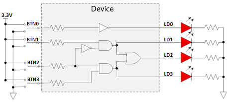
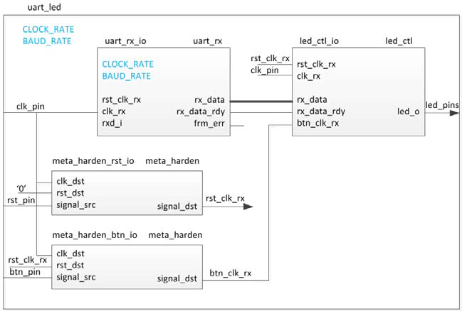

# Vivado FPGA Design Flow on Spartan and Zynq
This workshop shows how to develop digital designs in Xilinx FPGA fabric and become familiar with synthesis, implementation, I/O planning, simulation, static timing analysis and debug features of the Xilinx Vivado software.

The labs have been developed on a PC running Microsoft Windows 10 professional edition and using **Vivado 2021.2**.

## Supported boards

* [Boolean](https://www.realdigital.org/hardware/boolean) Spartan 7 development board
* [PYNQ-Z2](https://www.tulembedded.com/FPGA/ProductsPYNQ-Z2.html) Zynq development board

## References

* [Download Vivado 2021.2](https://www.xilinx.com/support/download/index.html/content/xilinx/en/downloadNav/vivado-design-tools/2021-2.html)
* [Vivado 2021.2 installation notes](https://www.xilinx.com/support/documentation/sw_manuals/xilinx2021_2/ug973-vivado-release-notes-install-license.pdf)

## Change Log

2021.2 Initial release; See https://github.com/xupgit/FPGA-Design-Flow-using-Vivado/ for previosu versions of this material. 

## Lab source files 

All the source files are located in **{this_repository}/sources/{BOARD}** where {BOARD} is a board specific folder. 

---
#### Lab setup

This repository can be cloned or downloaded to your computer. The path for the sources code should contain ascii characters only. Deep paths should be avoided since the maximum supporting length of path for Windows is 260 characters. 

In the lab instructions; 

**{SOURCES}** refers to *{this_repository}/sources*, and {this_repository} is the directory on your computer where you have copied the files. 

**{LABS}** refers to the working folder you will use for the lab projects you will create. 

**{BOARD}** refers to the target board; PYNQ-Z2 or Boolean 

---
**NOTE**

Board support for the Boolean and PYNQ-Z2 are not included in Vivado 2021.2 by default.

**For Pynq-z2:**

For the PYNQ-Z2, when creating Vivado projects, select the **xc7z020clg400-1** Zynq-7 device with the following attributes:

| **Part Number**       | xc7z020clg400-1 |
| --------------------- | --------------- |
| **Family**            | Zynq-7          |
| **Package**           | clg400          |
| **Speed Grade**       | -1              |
| **Temperature Grade** | C               |

**For Boolean:**

For the Boolean board, when creating Vivado projects, select the **xc7s50csga342-1** Spartan-7 device with the following attributes:

| **Part Number**       | xc7s50csga342-1 |
| --------------------- | --------------- |
| **Family**            | Spartan-7       |
| **Package**           | ccsga324        |
| **Speed Grade**       | -1              |
| **Temperature Grade** | C               |

---

## Hardware Setup

**PYNQ-Z2**: Connect the board to the PC using a micro USB cable. Make sure that a jumper is connected to JTAG (between JP1_1 and JP1_2) to use the board in the development mode. Also, make sure that another jumper is placed between J9_2 and J9_3 to select USB as a power source. The PYNQ-Z2 needs to be connected to a full power USB port to operate correctly. 

**Boolean**: Connect your Boolean board to your Computer with a micro USB cable. Connect the micro-USB cable to the port labeled “**PROG UART**”. Turn on your board by moving the switch in the top-left corner to the *On* position. You’ll see a Green LED by the switch when it powers on. If your board doesn’t power on, check that the blue jumper by the port labeled “**EXTP**” is set to “**USB**”.

## Labs Overview:

### Lab 1
This lab guides you through the process of using the Vivado IDE to create a simple HDL design.  You will simulate, synthesize, and implement the design with default settings. You will generate the bitstream and download it to the boardto verify the design functionality.

### Lab 2
This lab shows you the synthesis process and the effects of changing of synthesis settings. You will analyze the design and the generated reports.

### Lab 3
This lab continues from the previous lab. You will perform static timing analysis. You will implement the design with the default settings and generate a bitstream and test it on the board. 

### Lab 4
You will use the IP Catalog to generate a clock resource. You will instantiate the generated clock core in the provided waveform generator design. You will also use *IP Integrator* to generate a FIFO core and then use it in the HDL design.

### Lab 5
You will use the uart_led design that was introduced in the previous labs. You will start the project with I/O Planning type, enter pin locations, and export it to the rtl. You will then create the timing constraints and perform the timing analysis.

### Lab 6
You will use the uart_led design that was introduced in the previous labs. You will use the *Mark Debug* feature and the *Integrated Logic Analyzer (ILA)* core (from the IP Catalog) to debug the hardware.

## Contributing

We welcome contributions, please review the [contributing](CONTRIBUTING.md) guidelines to contribute.

## Licenses

Copyright&copy; 2022, Advanced Micro Devices, Inc.

[SPDX-License-Identifier: BSD-3-Clause](LICENSE)

### Binary Files License

Pre-compiled binary files are not provided under an OSI-approved open source license, because Advanced Micro Devices, Inc. is incapable of providing 100% corresponding sources.

Binary files (Zynq boot files - BOOT.BIN) are provided under the following [license](./source/pynq-z2/lab6/LICENSE)

------------------------------------------------------

Copyright&copy; 2022, Advanced Micro Devices, Inc.
