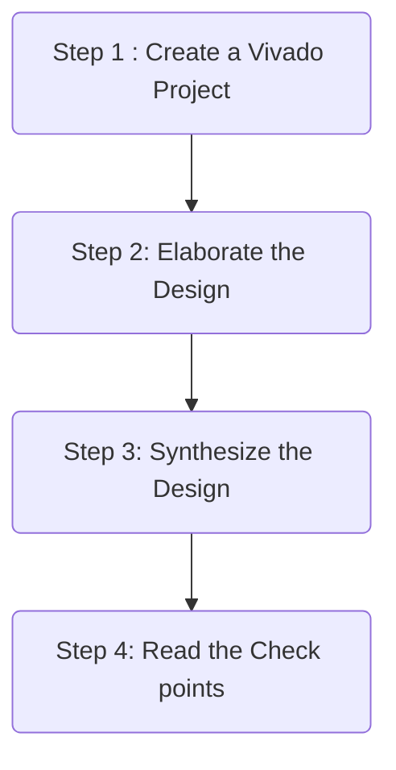
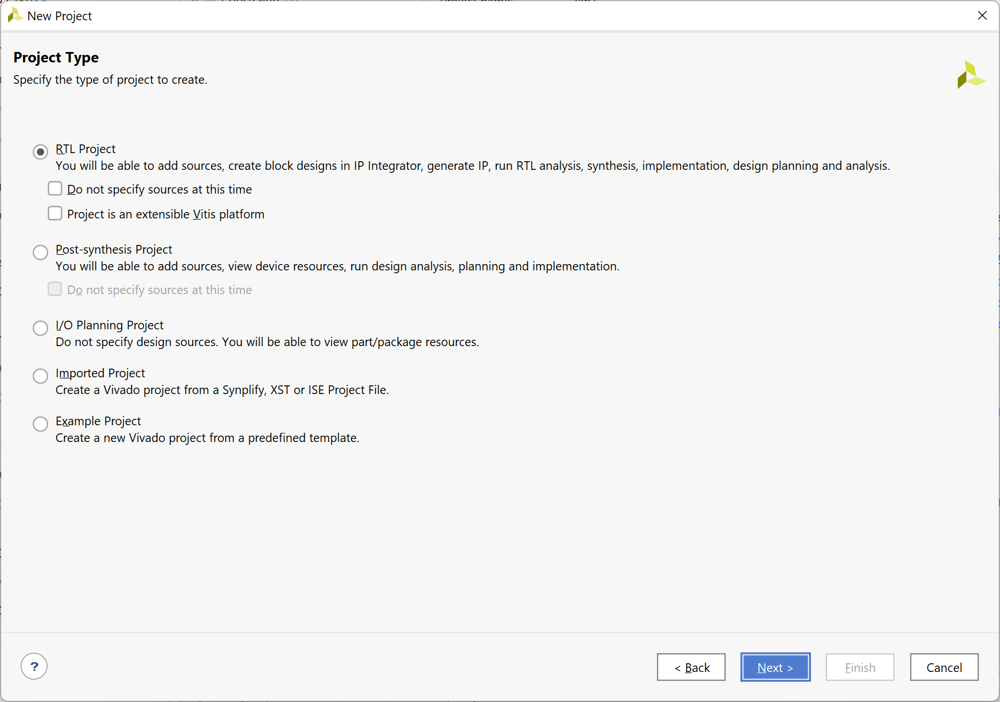
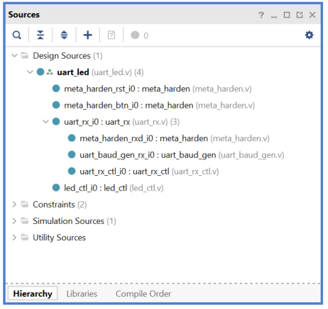
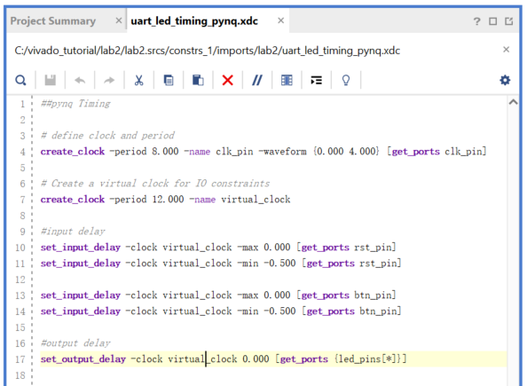
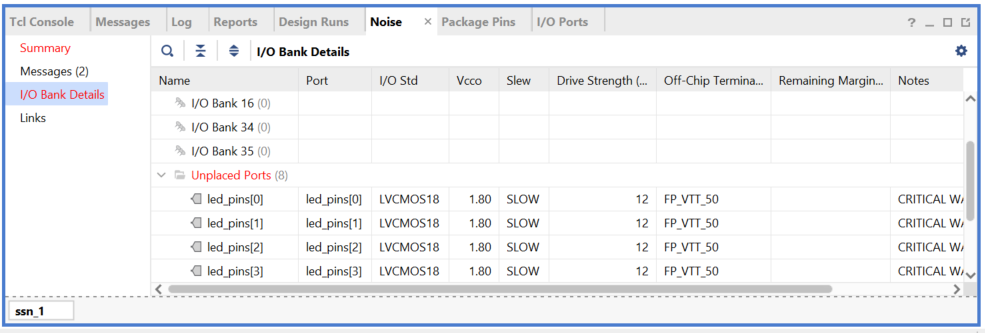
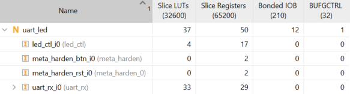
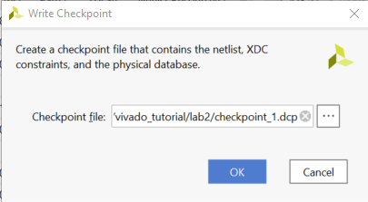
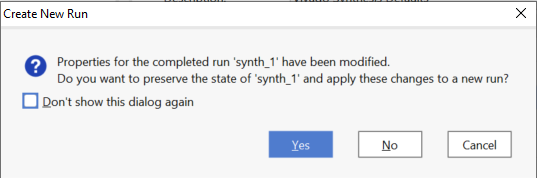
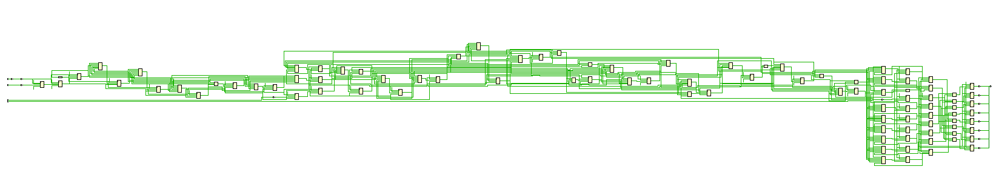

# Synthesizing a RTL Design

## Objectives

After completing this lab, you will be able to:

- Use the provided Xilinx Design Constraint (XDC) file to constrain the timing of the circuit.

- Elaborate on the design and understand the output.

- Synthesize the design with the provided basic timing constraints.

- Analyze the output of the synthesized design.

- Change the synthesis settings and see their effects on the generated output.

- Write a checkpoint after the synthesis so the results can be analyzed after re-loading it.

## Procedure
This lab is broken into steps that consist of general overview statements providing information on the
detailed instructions that follow. Follow these detailed instructions to progress through the lab.

## Design Description
The design consists of a uart receiver receiving the input typed on a keyboard and displaying the binary
equivalent of the typed character on the 8 LEDs. When a push button is pressed, the lower and upper
nibbles are swapped. The block diagram is as shown in the following figure.


<div align = "center">

</div>

<p align = "center">
<i>The Completed Design</i>
</p>

## General Flow



###  In the instructions for the tutorial

The absolute path for the source code should only contain ascii characters. Deep path should also be avoided since the maximum supporting length of path for Windows is 260 characters.

**{SOURCES}** refers to *.\\source\\{BOARD}\\*. You can use the source files from the cloned repository's *source* directory.

**{TUTORIAL}** refers to *C:\vivado_tutorial\\*. It assumes that you will create the mentioned directory structure to carry out the labs of this tutorial.

**{BOARD}** refers to target *Boolean* and *Z2* boards.


## Step 1 Create a Vivado Project

### Launch Vivado and create an empty project targeting the XC7S50CSGA324-1(for Boolean) or XC7Z020CLG400-1 (PYNQ-Z2) board, selecting Verilog as a target language. Use the provided Verilog source files, uart_led_pins_{board}.xdc and uart_led_timing.xdc files from the {SOURCES}\lab2 directory.

1. Open Vivado by selecting **Start > All Programs > Xilinx Design Tools > Vivado 2021.2**.

2. Click **Create New Project** to start the wizard. You will see *Create A New Vivado Project* dialog
   box. Click **Next**.

3. Click the **Browse** button of the *Project location* field of the **New Project** form, browse to **{TUTORIAL}**,
   and click **Select**.

4. Enter **lab2** in the *Project name* field. Make sure that the *Create Project Subdirectory* box is checked. Click **Next**.

5. Select **RTL Project** option in the *Project Type* form, and click **Next**.


   <div align = "center">
   
   </div>

   <p align = "center">
   <i>Create a new project</i>
   </p>

6. Using the drop-down buttons, select **Verilog** as the *Target Language* and *Simulator Language* in the *Add Sources* form.

7. Click on the Green Plus button, then the *Add Files…* button and browse to the {SOURCES}\\{BOARD}\lab2 directory, select all the Verilog files *(led_ctl.v, meta_harden.v, uart_baud_gen.v, uart_led.v,*
    *uart_rx.v, and uart_rx_ctl.v*), click **OK**, and then click **Next** to get to the Add Existing IP form.

8. Since we do not have any IP to add, click **Next** to get to the *Add Constraints* form.

9. Click on the Blue Plus button, then *Add Files…* and browse to the {sources}\lab2 directory (if
    necessary), select *uart_led_timing.xdc* and click **Open**.

10. Click **Next**.
    This Xilinx Design Constraints file assigns the basic timing constraints (period, input delay, and
    output delay) to the design.

11. In the Default Part form, using the **Parts** option and various drop-down fields of the Filter section,
    select **XC7S50CSGA324-1**(for Boolean) or **XC7Z020CLG400-1**(PYNQ-Z2).

12. Click **Next**.

13. Click **Finish** to create the Vivado project.

   ---

   (If you are using PYNQ-Z2)

   1. Copy the tcl script `ps_init.tcl` from **{SOURCES}/pynq-z2/lab2** to **{TUTORIAL}/lab2**.In the Tcl Shell window enter the following command to change to the lab directory and hit **Enter**.

      ```tcl
      cd {TUTORIAL}/lab2
      ```

   2. Generate the PS design by executing the provided Tcl script.

      ```tcl
      source ps_init.tcl
      ```

   Please check if the path in the tcl script is correct or not.

   ---

#### Analyze the design source files hierarchy (Taking Boolean as an example).

1. In the Sources pane, expand the uart_led entry and notice hierarchy of the lower-level modules.

   <div align = "center">
   
   </div>

   <p align = "center">
   <i>Opening the source file (Boolean as example)</i>
   </p>

2. Double-click on the **uart_led** entry to view its content.
   Notice in the Verilog code, the BAUD_RATE and CLOCK_RATE parameters are defined to be
   115200 and 125M Hz(PYNQ-Z2) or 100 MHz(Boolean) respectively as shown in the design diagram. Also notice that the
   lower level modules are instantiated. The meta_harden modules are used to synchronize the
   asynchronous reset and push-button inputs.
3. Expand uart_rx_i0 instance to see its hierarchy.
   This module uses the baud rate generator and a finite state machine. The rxd_pin is sampled at a x16 the baud rate.

   #### Open the uart_led_timing.xdc source and analyze the content.

4. In the *Sources* pane, expand the *Constraints* folder and double-click the *uart_led_timing_{BOARD}.xdc*  entry to open the file in text mode.

   <div align = "center">
   
   </div>
   <p align = "center">
   <i>Timing constraints</i>
   </p>

   Line 3 creates the period constraint of 10 ns with a duty cycle of 50%. Line 6 creates a virtual clock of 12 ns. This clock can be viewed as the upstream device is generating its output with respect to its clock and outputs data with respect to it. The rxd_pin is constrained with respect to the design clock (lines 9, and 10) whereas the btn_pin is constrained with respect to the upstream clock (lines 12, 13). The led_pins are constrained with respect to the upstream clock as the downstream device may be using it.

## Step 2 Elaborate the Design

### Elaborate and perform the RTL analysis on the source file.

1. Expand the Open Elaborated Design entry under the *RTL Analysis* tasks of the *Flow Navigator*
   pane and click on **Schematic**.
   The model (design) will be elaborated and a logical view of the design is displayed.

   <div align = "center">
   
   </div>
   <p align = "center">
   <i>A logic view of the design</i>
   </p>

   A logic view of the design

   You will see four components at the top-level, 2 instances of meta_harden, one instance of
   uart_rx, and one instance of led_ctl.

2. To see where the uart_rx_i0 gets generated, right-click on the uart_rx_i0 instance and select Go
   To Source and see that line 84 in the source code is generating it.
3. Double-click on the uart_rx_i0 instance in the schematic diagram to see the underlying
   components.

   
   <div align = "center">
   
   </div>
   <p align = "center">
   <i>Lower level components of the uart_rx_i0 module</i>
   </p>

4. Click on **Report Noise** under the *Open Elaborated Design* entry of the *RTL Analysis* tasks of the
   *Flow Navigator* pane.
5. Click **OK** to generate the report named **ssn_1**.

   
   <div align = "center">
   
   </div>
   <p align = "center">
   <i>Noise report</i>
   </p>

6. View the **ssn_1** report and observe the unplaced ports, Summary, and I/O Bank Details are
   highlighted in red because the pin assignments were not done. Note that only output pins are
   reported as the noise analysis is done on the output pins.

7. Click on **Add Sources** under the *Project Navigator*, select *Add or Create Constraints* option and
   click **Next**.

8. Click on the Blue Plus button, then the **Add Files…** button and browse to the *{sources}\lab2*
   directory, select the *uart_led_pins_{BOARDS}.xdc* file (depending on the target board), click **OK**,
   and then click **Finish** to add the pins location constraints.

   Notice that the sources are modified and the tools detect it, showing a warning status bar to reload
   the design.

   
   <div align = "center">
   
   </div>

9. Click on the **Reload** link. The constraints will be processed.
10. Click on **Report** **Noise** and click **OK** to generate the report named **ssn_1**. Observe that this time
    it does not show any errors (no red).

## Step 3 Synthesize the Design

### Synthesize the design with the Vivado synthesis tool and analyze the Project Summary output.

1. Click on **Run** **Synthesis** under the *Synthesis* tasks of the *Flow* Navigator pane.

   The synthesis process will be run on the *uart_led.v* and all its hierarchical files. When the process is completed a *Synthesis* Completed dialog box with three options will be displayed.

2. Select the **Open Synthesized Design** option and click **OK** as we want to look at the synthesis output.

   Click **Yes** to close the elaborated design if the dialog box is displayed.

3. Select the Project Summary tab

   If you don’t see the Project Summary tab then select **Layout > Default Layout** .

4. Click on the **Table** tab in the *Project* Summary tab and fill out the following information.

   **Question 1**

   Look through the table and find the number used of each of the following:

   | Resources | Estimation |
   | --------- | ---------- |
   | FF        |            |
   | LUT       |            |
   | I/O       |            |
   | BUFG      |            |

5. Click on **Schematic** under the *Open* *Synthesized* *Design* tasks of *Synthesis* tasks of the *Flow*
   *Navigator* pane to view the synthesized design in a schematic view.

   <div align = "center">
   
   </div>
   <p align = "center">
   <i>Synthesized design’s schematic view</i>
   </p>

   Notice that IBUF and OBUF are automatically instantiated (added) to the design as the input and output are buffered. There are still four lower level modules instantiated.

6. Double-click on the *uart_rx_i0* instance in the schematic view to see the underlying instances.

7. Select the **uart_baud_gen_rx_i0** instance, right-click, and select Go To Source.

   Notice that the line instantiated *uart_rx_i0* is highlighted. Also notice that the CLOCK_RATE and
   BAUD_RATE parameters are passed to the module being called.

8. Go back to the schematic, double-click on the *meta_harden_rxd_io* instance to see how the synchronization circuit is implemented using two FFs. This synchronization is necessary to reduce the likelihood of metastability.

9. Click on the ( ) in the schematic view to go back to its parent block.

### Analyze the timing report

1. Click on **Report Timing Summary** under the *Synthesized* *Design* tasks of the *Flow* *Navigator*
   pane.
2. Click **OK** to generate the Timing_1 report.

   <div align = "center">
   
   </div>

   <p align = "center">
   <i>Timing report for the Boolean</i>
   </p>

   Notice that the Design Timing Summary and Inter-Clock and Intra-Clock Paths entry in the left pane is highlighted in red indicating timing violations. In the right pane, the information is grouped in Setup, Hold, and Width columns.

   Under the Setup column Worst Negative Slack (WNS) is linked indicating that clicking on it can give us insight on how the failing path has formed. The Total Negative Slack (TNS) is highlighted in red indicating the total amount of violations in the design and the Number of Failing Endpoints indicate total number of failing paths.

3. Click on the WNS link and see the 8 failing paths.

   <div align = "center">
   
   </div>

   <p align = "center">
   <i>The 8 failing paths for the Boolean</i>
   </p>

4. Double-click on the **Path 23** to see how the path is made.

   <div align = "center">
   
   </div>

   <p align = "center">
   <i>Worst failing path for the Boolean</i>
   </p>

   Note that this is an estimate only. The nets are specified as unplaced and have all been allocated default values (0.800 ns). No actual routing delays are considered.

### Generate the utilization and power reports.

1. Click **Report Utilization** under the *Synthesized Design*, and click **OK** to generate the utilization report.

   <div align = "center">
   
   </div>

   <p align = "center">
   <i>Utilization report for the Boolean</i>
   </p>
   **Question 2**

      Look through the table and find the number used of each of the following:

   | Resources | Estimation |
   | --------- | ---------- |
   | FF        |            |
   | LUT       |            |
   | I/O       |            |
   | BUFG      |            |

2. Select Slice LUTs entry in the left pane and see the utilization by lower-level instances. You can    expand the instances in the right pane to see the complete hierarchy utilization.

   <div align = "center">
   
   </div>
   <p align = "center">
   <i>Utilization of lower-level modules for the Boolean</i>
   </p>

3. Click **Report Power** under the Synthesized Design, and click **OK** to generate the estimated power consumption report using default values.
   Note that this is just an estimate as no simulation run data was provided and no accurate activity
   rate, or environment information was entered.


   <div align = "center">
   
   </div>

**Question 3**
From the power report, find the % power consumption used by each of the following:

| Categories | Partition |
| ---------- | --------: |
| FF         |         % |
| LUT        |         % |
| I/O        |         % |
| BUFG       |         % |

You can move the mouse on the boxes which do not show the percentage to see the consumption.

### Write the checkpoint in order to analyze the results without going through the actual synthesis process.

1. Select **File > Checkpoint > Write** to save the processed design so it can be opened later for    further analysis.
2. A dialog box will appear showing the default name of the file in the current project directory.

   
   <div align = "center">
   
   </div>
   <p align = "center">
   <i>Wiring Checkpoint</i>
   </p>

3. Click **OK**

### Change the synthesis settings to flatten the design. Re-synthesize the design and analyze the results.

1. Click on the **Settings** under the *Project Manager*, and select **Synthesis**.
2. Click on the **flatten_hierarchy** drop-down button and select **full** to flatten the design.


   <div align = "center">
   
   </div>
   <div align = "center">
   
   </div>
   <p align = "center">
   <i>Selecting flatten hierarchy option</i>
   </p>


3. Click **OK**.

4. A Create New Run dialog box will appear asking you whether you want to create a new run since  the settings have been changed.

 
   <div align = "center">
   
   </div>

   <p align = "center">
   <i>Create New Run dialog box</i>
   </p>


5. Click **Yes**

6. Change the name from **synth_1_copy_1** to **synth_flatten** and click **OK**.

7. Click **Run Synthesis** to synthesize the design.

8. Click **OK** to open the synthesized design when synthesis process is completed.

9. Click on **Schematic** under the *Open Synthesized Design* tasks of *Synthesis* tasks of the *Flow Navigator* pane to view the synthesized design in a schematic view.
   Notice that the design is completely flattened.

   <p align="center">
   
   <i>Flattened design</i>
   </p>
   


10. Click on **Report Utilization** and observe that the hierarchical utilization is no longer available.
    Also note that the number of Slice Registers is 37.

### Write the checkpoint in order to analyze the results without going through the actual synthesis process.

1. Select **File > Checkpoint > Write** to save the processed design so it can be opened later for further analysis.

2. A dialog box will appear showing the default name of the file in the current project directory.

3. Click **OK**.

## Step 4 Read the Checkpoints

### Read the previously saved checkpoint (checkpoint_1) in order to analyze the results without going through the actual synthesis process.

1. Launch Vivado and select **File > Checkpoint > Open ** at the *Getting Started* Screen.

2. Browse to **{TUTORIAL}/lab2** and select *uart_led.dcp* or *system_wrapper.dcp*

3. Click **OK**

4. If the schematic isn’t open by default, in the netlist tab, select the top-level instance, uart_led/system_wrapper, right-click and select **Schematic**.

   You will see the hierarchical blocks. You can double-click on any of the first-level block and see
   the underlying blocks. You can also select any lower-level block in the netlist tab, right-click and select Schematic to see the corresponding level design.

5. In the netlist tab, select the top-level instance, uart_led, right-click and select **Show Hierarchy.**

   You will see how the blocks are hierarchically connected.

6. Select **Reports > Timing > Report Timing Summary** and click **OK** to see the report you saw previously.

7. Select **Reports > Report Utilization** and click **OK** to see the utilization report you saw previously.

8. Select **File > Open Checkpoint**, browse to **{TUTORIAL}/lab2** and select *uart_led.dcp* or *system_wrapper.dcp*.

9. Click **No** to keep the *Checkpoint_1* open.

   This will invoke second Vivado GUI.

10. If the schematic isn’t open by default, in the netlist tab, select the top-level instance, *uart_led*, right-click and select Schematic.  You will see the flattened design.

11. You can generate the desired reports on this checkpoint as you wish.

12. Close the Vivado program by selecting **File > Exit** and click **OK**.

## Conclusion
In this lab you applied the timing constraints and synthesized the design. You viewed various post-synthesis reports. You wrote checkpoints and read it back to perform the analysis you were doing during the design flow. You saw the effect of changing synthesis settings.

------------------------------------------------------
<p align="center">Copyright&copy; 2023, Advanced Micro Devices, Inc.</p>