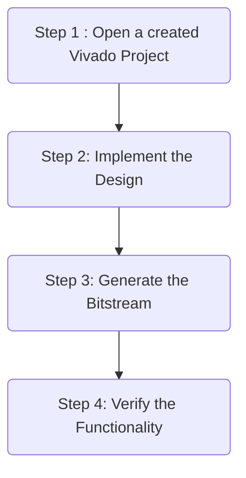
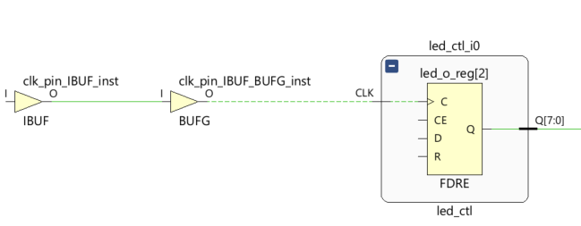
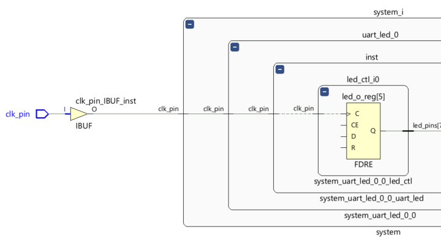
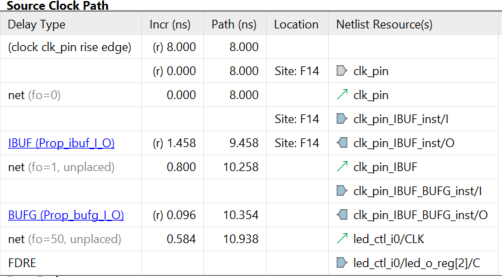
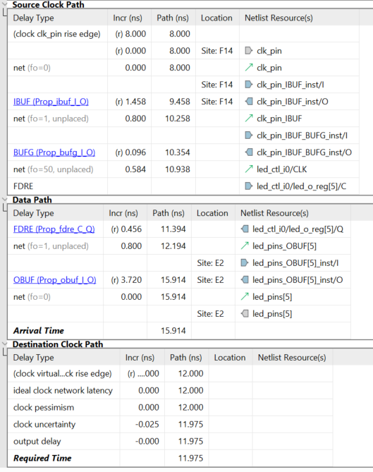
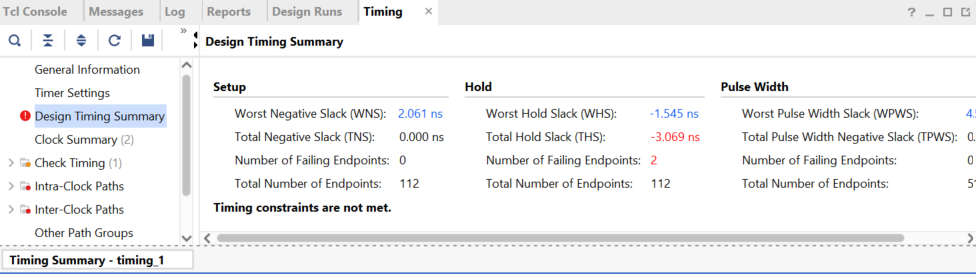
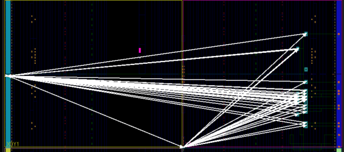
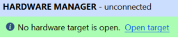

# Implementing the Design

## Introduction

This lab continues with the previous lab. You will perform static timing analysis. You will implement the design with the default settings and generate a bitstream. Then you will open a hardware session and program the FPGA. You will use on-board UART of the Boolean or PYNQ-z2 board.

## Objectives

After completing this lab, you will be able to:

- Implement the design.

- Run static timing analysis.

- Generate various reports and analyze the results.

- Generate bitstream and verify the functionality in hardware.

## Procedure

This lab is broken into steps that consist of general overview statements providing information on the detailed instructions that follow. Follow these detailed instructions to progress through the lab.
## General Flow

### In the instructions below:

**{SOURCES}** refers to *.\\source\\{BOARD}\\Labn*. You can use the source files from the cloned repository's *source* directory.

**{TUTORIAL}** refers to *C:\vivado_tutorial\\*. It assumes that you will create the mentioned directory structure to carry out the labs of this tutorial.

**{BOARD}** refers to target *Boolean* and *Z2* boards.

## Steps

### Step 1 Open a Vivado Project using IDE

#### Launch Vivado and open the lab2 project. Save the project as lab3 in the {TUTORIAL} directory making sure that the create subdirectory option is selected. Set the flatten_hierarchy setting to rebuilt. Create new synthesis run naming it as synth_2.

1. Start the Vivado, if necessary, and open either the *lab2* project (lab2.xpr) you created in the previous lab or the *lab2* project in the **labsolution** directory using the **Open Project** link in the *Getting Started* page.

2. Select **File > Project > Save As …** to open the *Save Project As* dialog box. Enter **lab3** as the project name. Make sure that the *Create Project Subdirectory* option is checked, the project directory path is **{TUTORIAL}** and click **OK**.

3. Click on the *Settings* in the *Flow Navigator* pane, select **Project Settings > Synthesis**.

4. Make sure that the *flatten_hierarchy* is set to **rebuilt**, which allows the design hierarchy to be preserved for synthesis, and then rebuilt which is more useful for design analysis because many logical references will be maintained.

5. Click **OK**.

     A Create *New Run* dialog box will appear asking you if a new run should be created. Click **Yes**
     and then **OK** to create the new run with *synth_2* name.

#### Synthesize the design. Generate the timing summary and analyze the design.

1. Click on **Run Synthesis** under the *Synthesis* tasks of the *Flow Navigator* pane.

   The synthesis process will be run on the *uart_led.v* and all its hierarchical files. When the process is completed a *Synthesis Completed* dialog box with three options will be displayed.

2. Select the *Open Synthesized Design* option and click **OK** as we want to look at the synthesis
    output.

3. Click on **Report Timing Summary** under the *Synthesized Design* tasks of the *Flow Navigator*
    pane.

4. Leave all the settings unchanged, and click **OK** to generate a default timing report, *timing_1*.

5. Click on the link beside the **Worst Negative Slack** (WNS) and see the 8 failing paths.

6. Double-click on the Path 23 to see a detailed view of the path. The path report shows four
    sections: (i) Summary, (ii) Source Clock Path, (iii) Data Path, and (iv) Destination Clock Path.

7. Select Path 23 in the *timing* tab, right-click, and select **Schematic**.
    The schematic for the output data path will be displayed.

<i>The output data path(Boolean)</i>

<i>The output data path(PYNQ-Z2)</i>

8. In order to see how the Source Clock Path is made up in schematic form, double-click on left end  of the C pin of the FDRE in the schematic.
    This will show the net between the BUFG and C port of the FDRE.

9. Similarly, double-click on the left end of the BUFG to see the path between IBUF and BUFG.

<i>Source to clock port of the FDRE</i>

<i>The schematic view of the source clock path(Boolean)</i>

<i>The schematic view of the source clock path(PYNQ-Z2)</i>

  This corresponds to the Source Clock Path in the timing report.

<i>The source clock path for the Boolean</i>

Since the virtual clock is slower (12 ns) than the clk_pin period (10 ns for Boolean or 8 ns for PYNQ-Z2), the data path delay includes the clock period of the clk_pin clock source.

<i>Worst failing path for the Boolean</i>

#### Change the design constraint to constrain the virtual clock period to 10ns. Re-synthesize the design and analyze the results.

1. Click **Edit Timing Constraints** under the Synthesized Design.

   The *Timing Constraints* GUI will appear, showing the design has two created clocks, four inputs, and one output constraints. It also shows the constraints in the text form in the *All Constraints*
   section.

   

<i>Timing Constraints showing 12 ns Virtual Clock period defined (Boolean)</i>

2. Click in the Period cell of the virtual_clock and change the period from 12 to 10(Boolean) or to 8(PYNQ-z2)

3. Click **Apply**.
    Note that since the timing constraint has changed, a warning message in the console pane is displayed to rerun the report.

  

4. Click on Rerun.
    Notice that setup timing violations are gone. However, there are still 2 failing paths for the Hold.

 

<i> Setup timing met</i>

5. Click on the *WHS* link to see the paths.

6. Double-click on the first path to see the timing compositions. Notice that the clock path delay does not include the entire clock period.

7. Select **File > Constraint > Save**

8. Click **OK** and then click **Yes** to save the synthesized design.
Notice that the Synthesis Out-of-Date status is displayed on the top-right corner.

### Step 2 Implement the Design

#### Run the implementation after saving the synthesis run. Perform the timing analysis.

1. In the *Design Runs* tab, right-click on the **synth_1** and select **Reset Runs**. Make sure the generated files are deleted. Click **Reset**.

2. Click the **Close Design** link in the status bar. If prompted, do not save anything.

3. Click on the **Run Implementation** in the *Flow Navigator* pane.

4. Click **OK** when prompted to run the synthesis first before running the implementation process.
When the implementation is completed, a dialog box will appear with three options.

5. Select the *Open Implemented Design* option and click **OK**.

#### View the amount of FPGA resources consumed by the design using Report Utilization.

1. In the *Flow Navigator* pane, select **Open Implemented Design > Report Utilization**. The *Report Utilization* dialog box opens.

2. Click **OK**.
   The utilization report is displayed at the bottom of the Vivado IDE. You can select any of the resources on the left to view its corresponding utilization.

3. Select Slice LUTs to view how much and which module consumes the resource.

<i>Resource utilization for the Boolean</i>

#### Generate a timing summary report.

1. In the *Flow Navigator*, under **Implementation > Open Implemented Design**, click **Report Timing Summary.**
The Report Timing Summary dialog box opens.
2. Leave all the settings unchanged and click **OK** to generate the report.

<i>The timing summary report showing timing violations</i>

3. Click on the *WNS* link to see a detailed report to determine the failing path entries.

4. Double-click on the first failing path to see why it is failing.

  

<i>First failing path delays for the Boolean</i>

Compared to delays from the synthesis report, the net delays are actual delays (rather than an estimated figure). The data path delay is longer than the destination clock path delay giving a negative slack (violation). The data path delay is 11.534 ns for the Boolean, the destination clock path is 9.975 ns and the negative slack is -1.559 ns (in this case).
At this point we can ignore this violation as the LED display change by a few nanoseconds won’t be observable by human eyes. We can also change the output delay by approximately -2 ns and make the timings meet.

5. Select **Implemented Design** > **Edit Timing Constraints** the *Flow Navigator* pane.

6. Select the *Set Output Delay entry* in the left pane, select all the output ports and change the Delay Value to -2.000 ns.

7. Click **OK**, and return to the timing constraints tab, click **apply**

8. Click **Rerun** link to re-run the timing report.
    Observe that the timing violations of the Intra-clock paths are gone.

9. Expand the **Intra-Clock Paths** folder on the left, expand *clk_pin*, and select the *Setup* group to
    see the list of 10 worst case delays on the right side.

10. Double-click on any of the paths to see how that is made up of. Also right-click on it and select
    **Schematic**.
    Click on the **Device** tab and see the highlighted path in the view.

11. Select **Open Implemented Design > Report Clock Networks**.

12. Click **OK**.
    The Clock Networks report will be displayed in the Console pane showing two clock net entries.

13. Select *clk_pin* entry and observe the selected nets in the Device view.
    The clock nets are spread across multiple clock regions.

<i>Clock nets for the Boolean</i>

### Step 3 Generate the Bitstream

#### Generate the bitstream.

1. In the *Flow Navigator*, under Program and Debug, click **Generate Bitstream.**

<i>Generating the bitstream</i>

2. Click **Save** to save the constraints since the timing constraints had been changed, click **OK**, and then **Yes** to reset the runs and re-run all the processes.
The write_bitstream command will be executed (you can verify it by looking in the Tcl console).

3. Click **Cancel** when the bitstream generation is completed.

### Step 4 Verify the Functionality

---

**For Boolean:**

#### Connect the board and power it ON. Open a hardware manager session, and program the FPGA.

1. Make sure that the micro-USB cable is connected to the *JTAG PROG connector* (next to the power supply connector). Make sure that the jumper on the board is set to select *USB* power.
2. Select the *Open Hardware Manager* option and click **OK**.
    The Hardware Manager window will open indicating “unconnected” status.
3. Click on the **Open target** link, then **Auto Connect** from the dropdown menu.

  

<i>Opening new hardware target</i>

4. The *Hardware Manager Session* status changes from **Unconnected** to the server name and the device is highlighted. Also notice that the *Status* indicates that it is not programmed.
5. Select the device in the Hardware Device Properties, and verify that the **uart_led.bit** is selected as the programming file in the General tab.

**For PYNQ-Z2:**

#### Insert the SD card, connect the board and power it ON. Open a hardware manager session, and program the FPGA.

1. Copy the provided SD card boot image (**{SOURCES}**/lab3/BOOT.bin) into a blank SD card, noticing that file system of SD card should be FAT32.
2. Insert the SD card to the SD card slot on the back of the board and set the booting jumper to **SD**.
3. Select the *Open Hardware Manager* option and click **OK**.
   The Hardware Manager window will open indicating “unconnected” status.

  

<i>Opening new hardware target</i>

4. The *Hardware Manager Session* status changes from **Unconnected** to the server name and the device is highlighted. The status may indicate that the device is programmed, **ignore the status**.
5. Select the device in the *Hardware Device Properties*, and verify that the **uart_led.bit** is selected as the programming file in the General tab.

---

### Start a terminal emulator program such as Mobaxterm or TeraTerm . Select an appropriate COM port (you can find the correct COM number using the Control Panel). Set the COM port for 115200 baud rate communication. Program the FPGA and verify the functionality.

1. Start a terminal emulator program such as Mobaxterm or TeraTerm.

2. Select an appropriate COM port (you can find the correct COM number using the Control Panel).

3. Set the COM port for 115200 baud rate communication.

4. Right-click on the FPGA entry in the Hardware window and select **Program** **Device**

5. Click on the Program button.

   The programming bit file will be downloaded and the DONE light will be turned ON when the FPGA has been programmed.

6. Type in some characters in the terminal emulator window and see the corresponding ASCII equivalent bit pattern displayed on the LEDs.

7. Press and hold BTNU and see the the upper four bits are swapped with the lower four bits on the LEDs.

8. When satisfied, Select **File > Close Hardware Manager**. Click **OK**.

9. Close the terminal emulator program and power OFF the board.

10. Close the Vivado program by selecting **File > Exit** and click **OK**.

## Conclusion
In this lab, you learned about many of the reports available to designers in the Vivado IDE. You had the opportunity to learn basic design analysis tools including the Schematic viewer, delay path properties and reports viewer, Device viewer, and selecting primitive parents. You also learned about the basic timing report options that are at your disposal. You verified the functionality in hardware by typing characters on the host machine and seeing the LED pattern changes.

------------------------------------------------------

Copyright&copy; 2022, Advanced Micro Devices, Inc.
