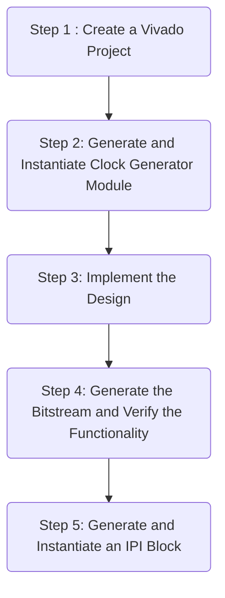
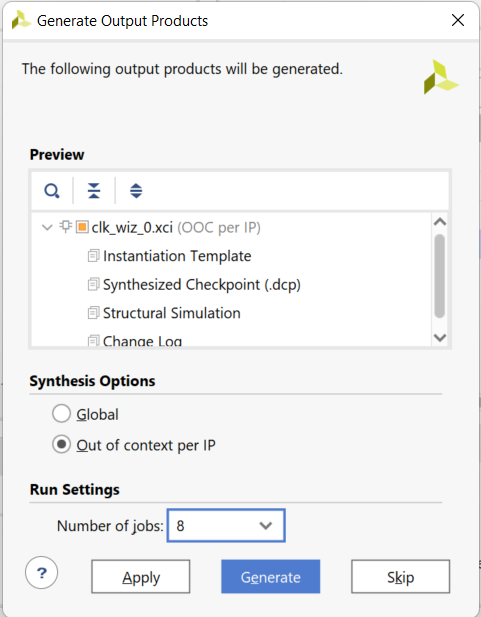
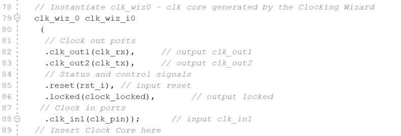
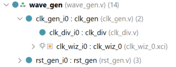

# Using the IP Catalog and IP Integrator

## Introduction

In this lab you will use the IP Catalog to generate a clock resource. You will instantiate the generated clock core in the provided waveform generator design. You will also use IP Integrator to generate a FIFO core and then use it in the HDL design.

## Objectives

After completing this lab, you will be able to:

- Include an IP in the project during the project creation.

- Use IP Catalog to generate a clocking core.

- Instantiate the generated core.

- Create a block design using IP Integrator.

- Instantiate the block design.

- Generate bitstream and verify the functionality in hardware.


## Design Description

The design used in this lab is a programmable waveform generator, also known as a signal generator.

The waveform generator in this design is intended to be a “standalone” device that is controlled via a PC (or other terminal device) using RS-232 serial communication. The design described here implements the RS-232 communication channel, the waveform generator and connection to the external DAC, and a simple parser to implement a small number of “commands” to control the waveform generation.

The wave generator implements a look-up table of 1024 samples of 16 bits each in a RAM. The wave generator also implements three variables:

- nsamp: The number of samples to use for the output waveform. Must be between 1 and 1024.

- prescale: The prescaler for the sample clock. Must be 32 or greater.

- speed: The speed (or rate) for the output samples in units of the prescaled clock.


The wave generator can be instructed to send the appropriate number of samples once, cycling from 0 to nsamp-1 once and then stopping, or continuously, where it continuously loops the *nsamp* samples. When enabled, either once or continuously, the wave generator will send one sample to the DAC every (prescale x speed) *clk\_tx* clock cycles. The contents of the RAM, as well as the three variables, can be changed via commands sent over the RS-232 link, as can the mode of the wave generator. The wave generator will generate responses for all commands.

There are three clock domains within this design: **clk\_rx**, **clk\_tx**, and **clk\_samp**. The clock generator module instantiates all the clocking resources required for generating these three clocks. All three clocks are derived from a single clock input, coming in on **clk\_pin**. The frequency of the clock input is 100MHz for Boolean and 125MHz for PYNQ-Z2.

---

**For PYNQ-Z2:**

In this design we will use board’s USB-UART which is controlled by the Zynq’s ARM Cortex-A9 processor.  Our PL design needs access to this USB-UART. So first thing we will do is to create a Processing System design which will put the USB-UART connections in a simple GPIO-style and make it available to the PL section.

The provided design places the UART (RX and TX) pins of the PS (processing system) on the Cortex-A9 in a simple GPIO mode to allow the UART to be connected (passed through) to the programmable logic.  The processor samples the RX signal and sends it to the EMIO channel 0 which is connected to Rx input of the HDL module provided in the Static directory. Similarly, the design samples the Tx output of the HDL module through another EMIO channel 1 and sends it on the PS UART TX pin. This part has been integrated into a boot image `BOOT.bin`located in the **{SOURCES}/{BOARD}/lab4** folder. There will be no need for you to run the PS side configuration or software application.

**For Boolean:**

Boolean board will be using the on-board UART port to implement such function. It does not have PS block and hence no need to configure it.

---

The system block diagram is as shown below:

<p align="center">

</p>
<p align = "center">
<i>The Complete Design in PL</i>
</p>

<p align="center">

</p>
<p align = "center">
<i>The Complete System</i>
</p>

## General Flow



### Instructions for the tutorial

The absolute path for the source code should only contain ascii characters. Deep path should also be avoided since the maximum supporting length of path for Windows is 260 characters.

**{SOURCES}** refers to *.\\source\\{BOARD}\\*. You can use the source files from the cloned repository's *source* directory.

**{TUTORIAL}** refers to *C:\vivado_tutorial\\*. It assumes that you will create the mentioned directory structure to carry out the labs of this tutorial.

**{BOARD}** refers to target *Boolean* and *Z2* boards.

## Steps

### Step 1 Create a Vivado Project using IDE

---

**For Boolean:**

*Skip for PYNQ-Z2 targeted design*

#### Launch Vivado and create a project targeting XC7S50CSGA324-1 parts, and using the Verilog HDL. Use the provided Verilog source files, a device specific ip, and XDC  files from the **{SOURCES}**\lab4 directory.

**For PYNQ-Z2:**

*Skip for Boolean targeted design*

In this design we will use board’s USB-UART which is controlled by the Zynq’s ARM Cortex-A9 processor.  Our PL design needs access to this USB-UART. So first thing we will do is to create a Processing System design which will put the USB-UART connections in a simple GPIO-style and make it available to the PL section.

*For either of the boards*

#### Launch Vivado and create a project targeting the XC7Z020clg400-1 device, and use the provided tcl script file (ps_init.tcl) to generate the block design for the PS subsystem. Also, add the Verilog HDL files, wave\_gen\_pins\_pynq.xdc and wave\_gen\_timing\_pynq.xdc files from the **{SOURCES}**\{BOARD}\lab4 directory.

---

1. Open Vivado by selecting **Start > Xilinx Design Tools > Vivado 2021.2**.

2. Click **Create New Project** to start the wizard. You will see *Create A New Vivado Project* dialog box. Click **Next**.

3. Click the Browse button of the *Project location* field of the **New Project** form, browse to **{SOURCES}**, and click **Select**.

4. Enter **lab4** in the *Project name* field.  Make sure that the *Create Project Subdirectory* box is checked.  Click **Next**.

5. Select **RTL Project** option in the *Project Type* form, and click **Next**.

6. Using the drop-down button, select **Verilog** as the *Target Language* and *Simulator Language* in the *Add Sources* form.

7. Click on the **Blue Plus** button, then the **Add Files…** button and browse to the **{SOURCES}\lab4** directory, select all the Verilog files, click **OK**, and then click **Next**.

8. Click **Next** to get to the *Add Constraints* form.

9. Click on the **Blue Plus** button, then **Add Files…** and browse to the **{TUTORIAL}\lab4** directory (if necessary), select *wave\_gen\_timing\_{BOARD}.xdc* and the appropriate *wave\_gen\_pins\_{BOARD}.xdc* and click **Open**.

10. Click **Next.**

11. In the *Default Part* form, Use the **Boards** option, you may select the **Boolean** or the **PYNQ-Z2** depending on your board from the *Display Name* drop down field.

    You may also use the **Parts** option and various drop-down fields of the **Filter** section and select the **XC7Z020clg400-1** part(for PYNQ-Z2) or **XC7S50CSGA324-1** part(for Boolean).

12. Click **Next**.

13. Click **Finish** to create the Vivado project.  

### Correct the errors by adding file.

1. You will notice *Syntax Error Files* are being highlighted in the **Sources** pane.

   If you check the *messages* Tab, you will see that these errors are due to missing files.

2. Click on **Add Sources** in the *Flow Navigator* pane.

3. Select *Add or Create Design Sources* and click **Next**.

5. In the *File Type* field, select **All Files**, and then select **char\_fifo.xcix** file.

6. Click on the **Blue Plus** button, then the **Add Files…** button and browse to **{SOURCES}\lab4**

7. In the *File Type* field, select **All Files**, and then select **clogb2.txt** file.

8. Click **OK** and then **Finish**.

9. In the *Sources* pane, expand *Design Sources* and *wave\_gen\_top* and wave\_gen if necessary, and double-click on the **clk\_gen\_i0** entry.

   Scroll down the file and notice that around line 79 there is an instruction to instantiate a clock core.

---

**For PYNQ-Z2**

10. In the Tcl Shell window enter the following command to change to the lab directory and hit **Enter**.

    ```tcl
    cd {SOURCES}/lab4
    ```

11. Generate the PS design by executing the provided Tcl script.

    ```tcl
    source ps_init.tcl
    ```

    This script will create a block design called *system*, instantiate ZYNQ PS, enable two GPIO channels (GPIO14 and GPIO15) and two EMIO channels. It will create **system.bd** that is instantiated under `system\_wrapper.v wrapper` file. You can check the contents of the tcl file to confirm the commands that are being run.

---


### Step 2 Generate and Instantiate Clock Generator Module

#### Launch the clocking wizard from the IP Catalog of Vivado and generate the clock core with input frequency of 125.00 MHz (for PYNQ-Z2) or 100MHz(for Boolean) and two output clocks of 50.000 MHZ each(for PYNQ-Z2) or 100MHz each(for Boolean).    

1. Click on **IP Catalog** in the *Flow Navigator* pane. The IP Catalog will open in the auxiliary pane.

2. Expand the **FPGA Features and Design > Clocking** sub-folders and double-click on the **Clocking Wizard** entry.

   <p align="center">
   
   </p>
   <p align = "center">
   <i>Accessing the clocking wizard</i>
   </p>

3. Click **Customize IP** on the following Add IP window. The clocking wizard will open.

4. Make sure that the *Primary* input clock frequency is **125.000** MHz(for PYNQ-Z2) or **100.000** MHz(for Boolean) and the primitive used is **MMCM**.

   <p align="center">
   
   </p>
   <p align = "center">
   <i>The clocking wizard</i>
   </p>

5. Select the **Output Clocks** tab. Click on the check box to enable the second clock output. Make sure that the requested output frequency is **50** MHz(for PYNQ-Z2) or **100*** MHz(for Boolean) for both clocks.

   <p align="center">
   
   </p>
   <p align = "center">
   <i>Setting output clocks</i>
   </p>

6. Click on the **Summary** tab and check the information.

   <p align="center">
   
   </p>
   <p align = "center">
   <i>Summary page of the clock core being generated</i>
   </p>

7. Click **OK** to see the *Generate Output Products* form.

<p align="center">

</p>
<p align = "center">
<i>Generate output products form</i>
</p>

8. Click on **Generate** to generate the output products including the instantiation template. Click **OK** to proceed.

#### Instantiate the generated clock core.    

1. Select the **IP Sources** tab in the *Sources* pane.

2. Expand the **IP** branch. Notice the two IP entries. The *char\_fifo* IP is the core that was included while creating project.  The second core *clk\_core* is the one that you have generated.

3. Expand **clk\_wiz_0 > Instantiation Template** and double-click on **clk\_core.veo** to see the instantiation template.

4. Copy lines 72 through 81 and paste them at or around line 79 of the **clk\_gen.v** file.

5. Change the instance name and net names to as shown in the figure below to match the names of existing signals in the design.

   <p align="center">
   
   </p>
   <p align = "center">
   <i>Assigning instance name and net connections</i>
   </p>

6. Click () to save **clk\_gen.v**

7. Select the *Hierarchy* tab, expand the **wave_gen > clk\_gen\_i0** hierarchy and verify that clk\_core.xci is in the hierarchy. The IP has a bordered yellow square icon next to it.

   <p align="center">
   
   </p>
   <p align = "center">
   <i>The clk_wiz_0 instantiated and shown in the hierarchy</i>
   </p>

### Step 3 Implement the Design

1. Click on the **Run Implementation** in the *Flow Navigator* pane.

2. Click **OK** and run the synthesis first before running the implementation process. Click **Save** to save project if prompted.

   When the implementation is completed, a dialog box will appear with three options.  

3. Select the *Open Implemented Design* option and click **YES**.

#### View the amount of FPGA resources consumed by the design using Report Utilization.

1. In the ***Flow Navigator*** pane, select **Open Implemented Design > Report Utilization**.

   The Report Utilization dialog box opens.

2. Click **OK**.

3. Verify that the design is using the clock resource.

   <p align="center">
   
   </p>
   <p align = "center">
   <i>Clock resource utilization</i>
   </p>

### Step 4 Generate the Bitstream and Verify the Functionality

1. In the *Flow Navigator*, click **Program and Debug > Generate Bitstream**.

2. Click **Cancel** when the bitstream generation is completed.

### Connect the board and power it ON. Open a hardware manager session, and program the FPGA.  

1. Make sure that the Micro-USB cable is connected to the JTAG PROG.

2. Select the *Open Hardware Manager* option and click **OK**.

   The *Hardware Manager* window will open indicating “unconnected” status.

3. Click on the **Open target** link, then **Auto Connect** from the dropdown menu.

   You can also click on the **Open recent target** link if the board was already targeted before.

4. The *Hardware Manager* status changes from **Unconnected** to the server name and the device is highlighted. Also notice that the *Status* indicates that it is not programmed.

5. Select the device and verify that the **wave\_gen\_top.bit** is selected as the programming file in the *General* tab.

### Start a terminal emulator program such as TeraTerm or Mobaxterm. Select an appropriate COM port (you can find the correct COM number using the Control Panel).  Set the COM port for 115200 baud rate communication. Program the FPGA .

1. Start a terminal emulator program such as TeraTerm or HyperTerminal.

2. Select the appropriate COM port (you can find the correct COM number using the Control Panel).  

3. Set the *COM* port for **115200** baud rate communication.

4. Right-click on the FPGA entry in the Hardware window and select **Program Device…**

5. Click on the **Program** button.

   The programming bit file will be downloaded and the **DONE** light will be turned ON indicating the FPGA has been programmed.

---

**Extra Steps for PYNQ-Z2**

will be added after boot image has been made

---

4. Slide *Switch 0* to the **ON** position and type in some characters in the terminal window and see the character is echoed back.  Setting *Switch 0* to the ON position makes the design function as a loopback.

5. Select **File > Send File …** in the terminal emulator window.

6. Browse to **{SOURCES}\lab4**, select **testpattern.txt** file, and click **Open**.

   The file content will be send to the design.  The file content is as follows:

   **PFFFF                        < --  specifies the pre-scaling*

   **S0fff                         < -- specifies the speed value*

   **N000f                          < -- specifies the number of samples to play*

   **W00000000                 < -- write first sample of value 0 at location 0000*

   **W00011111                 < -- write second sample of value 0x1111 at location 0001*

   **W00022222*

   **W00033333*

   **W00044444*

   **W00055555*

   **W00066666*

   **W00077777*

   **W00088888*

   **W00099999*

   **W000AAAAA*

   **W000BBBBB*

   **W000CCCCC*

   **W000DDDDD*

   **W000EEEEE*

   **W000FFFFF*

7. The design understands various commands as listed in the figure below.  All values and addresses are in hexadecimal.

   <p align="center">
   
   </p>
   <p align = "center">
   <i>Commands</i>
   </p>

8. Type **\*G** in the terminal window and observe the LED pattern changing slowly as written by the above file

9. You can type **\*s** to see the sample value, **\*p** to see the prescale value, and **\*n** to see how many samples are being played back.

10. You can also type **\*H** to halt the play.

   <p align="center">
   
   </p>
   <p align = "center">
   <i>Terminal window display</i>
   </p>

11. Select **File > Close Hardware Manager**. Click **OK** to close it.

### Step 5 Generate and Instantiate an IPI Block

#### Save the project as lab4\_ipi. Remove the char\_fifo IP from the design.    

1. Select **File > Save Project As…** and save it as **lab4\_ipi** in the **{TUTORIAL}\lab4** directory making sure that the *Create Project Subdirectory* option is checked.

2. Select the **IP Sources** tab in the *Sources* pane.

3. Right-click on *char\_fifo*, and select **Remove File from Project…**

4. If a following window appears, click on the check-box of *Also delete the project local file/directory from disk*, and click **OK** or else continue to next step.

   <p align="center">
   
   </p>
   <p align = "center">
   <i>Removing an existing IP from the project</i>
   </p>

5. Select **Hierarchy** tab in the *Sources* pane and observe that the char\_fifo instance has a **?** mark indicating that it is missing the source file.

   <p align="center">
   
   </p>
   <p align = "center">
   <i>Removed source file</i>
   </p>

6. Double-click on the **wave\_gen.v** to open it in the editor window.

7. Toggle line comments the instantiation of the *char\_fifo* from the file around line 336.

<p align="center">

</p>
<p align = "center">
</p>


8. Select **File > Save File**.

#### Create a block design naming it as char\_fifo and add an instance of an FIFO Generator IP.    

1. Click on **Create Block Design** in the Flow Navigator block.

2. Enter **char\_fifo** as the block design name.

<p align="center">

</p>
<p align = "center">
<i>Naming the new block design</i>
</p>

3. Click **OK**.

   The IP Integrator workspace opens and, in the information area, invites you to begin adding IP.

4. Right-click in the IP Integrator design canvas and select *Add IP*.

   The IP Integrator IP Catalog opens, displaying a list of IP available in the IP Integrator.

5. Type **FIFO** in the search box at the top of the IP Integrator Catalog to see FIFO related available IPs.

<p align="center">

</p>
<p align = "center">
<i>Searching for an IP in the IP Catalog</i>
</p>

6. Double-click **FIFO Generator**.

   The FIFO is added to the IP Integrator design canvas.

   <p align="center">
   
   </p>
   <p align = "center">
   <i>FIFO Generator instantiated</i>
   </p>

#### Customize the FIFO Generator IP instance.    

1. Double-click the *FIFO Generator* IP, deselect **show disbled port**.

   The FIFO Generator displays in the Re-customize IP dialog box.

2. Make sure that the default Native option is selected for the interface type.

3. Select Independent Clocks Block RAM from the Fifo Implementation drop-down list.

   <p align="center">
   
   </p>
   <p align = "center">
   <i>Configuring BRAM for separate read and write clocks</i>
   </p>

4. Select the *Native Ports* tab.

   From the *Native Ports* tab you can configure the read mode, built-in FIFO options, data port parameters, and implementation options.

5. Select **First Word Fall Through** as the read mode.

6. Set the *write width* to be **8** bits.

7. Click in the **Read Width** field to see it automatically to match the write width.

8. Deselect the *Enable Safety Circuit* option.

<p align="center">

</p>
<p align = "center">
<i>Configuring Port Width and Read Mode</i>
</p>


9. Browse through the settings of the *Status Flags* and *Data Counts* tabs.

   These tabs configure other options for the FIFO Generator. For this design, leave everything at their default settings.

10. Select the *Summary* tab.

    This tab displays a summary of all the selected configuration options, as well as listing resources used for this configuration.

    <p align="center">
    
    </p>
    <p align = "center">
    <i>Summary page</i>
    </p>

11. Verify that the information is correct. For this configuration you are using one 18K block RAM. Click **OK**.

#### Make the ports external naming them as shown below.    

<p align="center">

</p>
<p align = "center">
<i>FIFO Generator IP fully generated and connected</i>
</p>


1. Expand the **FIFO\_WRITE** and **FIFO\_READ** interfaces.

2. Select *wr\_clk* and then press and hold the Ctrl key and select the *rd\_clk* ports of the FIFO.

3. With the ports highlighted, right-click and select **Make External**.

   Two external connections are created for the selected FIFO ports. Notice that the external connections have the same name as the IP module port that they connect to. You can rename these connections by selecting them and changing the name in the External Port Properties window.

4. Select the external connection port named **wr\_clk**.

5. In the *External Port Properties* window, in the Name field of the General tab, type the name **clk\_rx** and press Enter.  Similarly, select the external connection port named **rd\_clk** and change its name to **clk\_tx**.

   <p align="center">
   
   </p>
   <p align = "center">
   <i>Changing the external port name</i>
   </p>

6. You will need to expand *FIFO\_WRITE* and *FIFO\_READ* to see the signal names by clicking on the “+” symbols next to the bus names. While pressing the **Ctrl** key, click all of the remaining FIFO input and output ports and make them external.

7. Change their names as listed below:

   *din => char\_fifo\_din*

   *dout => char\_fifo\_dout*

   *empty => char\_fifo\_empty*

   *full => char\_fifo\_full*

   *rd\_en => char\_fifo\_rd\_en*

   *wr\_en => char\_fifo\_wr\_en*

   *rst => rst\_i*

   When you have finished, your subsystem design should look like the figure below.  

   <p align="center">
   
   </p>
   <p align = "center">
   <i>Renamed external ports</i>
   </p>

8. Click on **Regenerate Layout** () button from the vertical toolbar to see the above diagram.

9. Select **Tools > Validate Design**.

   You should see a message that validation was successful.

#### Generate the output product.

1. In the *IP Sources* tab of the **Sources** window, select the **char\_fifo** under the *Block Designs*.

2. Right-click and select **Generate Output Products**.

   <p align="center">
   
   </p>
   <p align = "center">
   <i>Generating the output products so the IP can be instantiated in the design</i>
   </p>

3. Click **Generate** and **OK** to generate the output products.

   You should see the various IP output products displayed in the IP Sources tab of the Sources window.

   <p align="center">
   
   </p>
   <p align = "center">
   <i>Generated output products</i>
   </p>

#### Instantiate the char\_fifo IP in the project.

1. From the *IP Sources* tab of the *Sources* window, select the **char\_fifo** module.

2. Right-click and select **View Instantiation Template**.

   <p align="center">
   
   </p>
   <p align = "center">
   <i>Generating an instantiation template</i>
   </p>

The *char\_fifo\_wrapper.v* instantiation template is opened in the text editor in the Vivado IDE.

<p align="center">

</p>
<p align = "center">
<i>Part of the Instantiation Template</i>
</p>


3. Copy lines 42 through line 51, and paste them at or around line 334 in the *wave\_gen.v* file.

4. Save the Verilog file.

#### Generate the bitstream and verify the functionality in hardware.

1. Click on the **Run Implementation** in the *Flow Navigator* pane.

   If prompted, click **Yes** to save the project before proceeding.

2. Click **OK** to re-run the synthesis process, followed by clicking **Save** to save the design.

3. When completed, generate the resource utilization report and verify that one FIFO is being used.

4. In the *Flow Navigator*, click **Program and Debug > Generate Bitstream**.

5. Open the hardware manager and program the FPGA.

---

**Extra Steps for PYNQ-Z2**

Will be delivered after completing the boot image of PYNQ-Z2.


---

6. verify the functionality of the design in the hardware.
7. When done, close the **Vivado** program by selecting **File > Exit** and click **OK**.

## Conclusion

In this lab, you learned how to add an existing IP during the project creation.  You also learned how to use IP Catalog and generate a core.  You then instantiated the core in the design, implemented the design, and verified the design in hardware.  You also used the IP Integrator capability of the tool to generate a FIFO and then use it in the HDL design.

------------------------------------------------------
<p align="center">Copyright&copy; 2022, Advanced Micro Devices, Inc.</p>