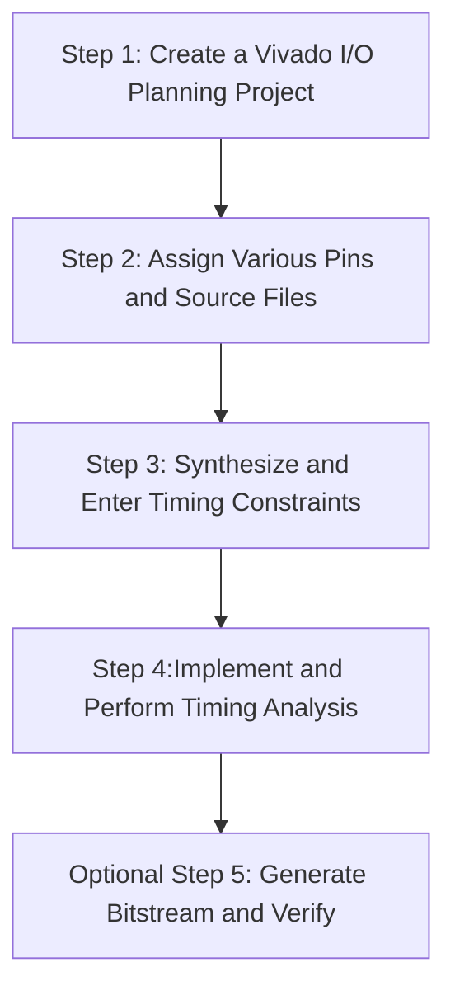
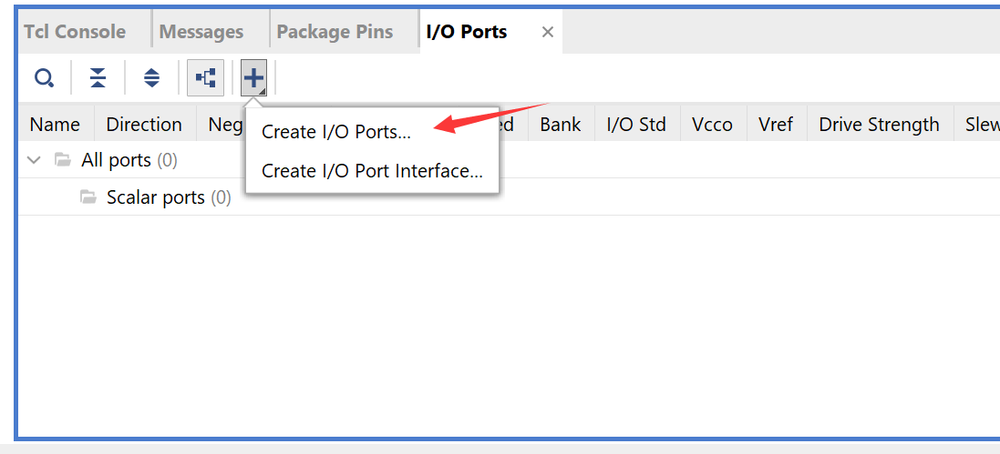
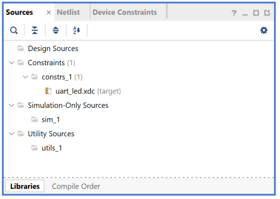
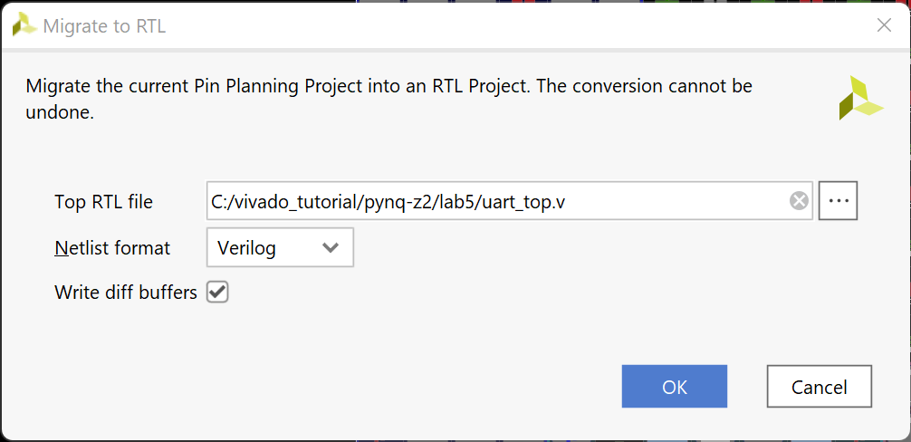
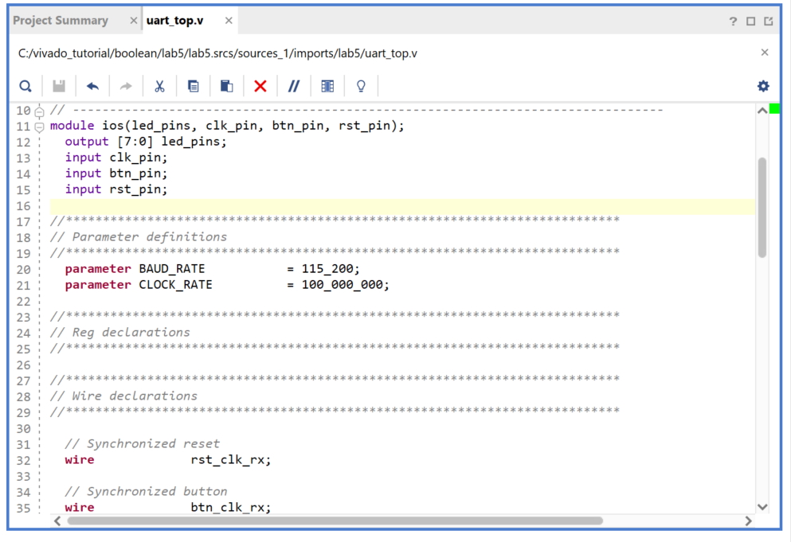
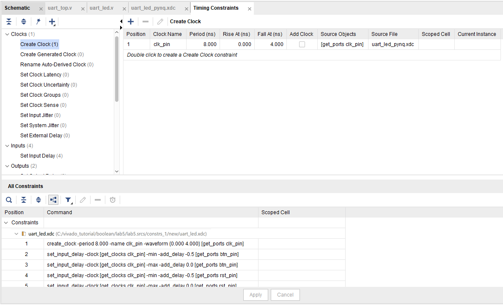

# Xilinx Design Constraints

## Introduction

In this lab you will use the uart_led design that was introduced in the previous labs. You will start the project with I/O Planning type, enter pin locations, and export it to the rtl. You will then create the timing constraints and perform the timing analysis

## Objectives

After completing this lab, you will be able to:

- Create a I/O Planning project.
- Enter the pin locations and IO standards via Device view, Package Pins tab, and Tcl commands.
- Create Period, Input Setup, and Output Setup delays.
- Perform timing analysis.

## Design Description

The design consists of a uart receiver receiving the input typed on a keyboard and displaying the binary equivalent of the typed character on the 8 LEDs. When a push button is pressed, the lower and upper nibbles are swapped. If you are using a PYNQ-Z2 development board, please make sure that you have a blank microSD card with FAT32 file system.

---

**For PYNQ-Z2:**

In this design we will use board’s USB-UART which is controlled by the Zynq’s ARM Cortex-A9 processor. Our PL design needs access to this USB-UART.  First thing we will do is to create a processing system design which will put the USB-UART connections in a simple GPIO-style and make it available to the PL section.

The provided design places the UART (RX) pin of the PS (processing system) on the Cortex-A9 in a simple GPIO mode to allow the UART to be connected (passed through) to the Programmable Logic. The processor samples the RX signal and sends it to the EMIO channel 0 which is connected to Rx input of the HDL module provided in the Static directory. This is done through a software application which has been built on the booting image located in **{SOURCES}/pynq-z2/BOOT.BIN**

**For Boolean:**

Boolean board will be using the on-board UART port to implement such function, without configuring the PS side.

---


<p align = "center">
<i>The Complete Design on PL</i>
</p>


<p align = "center">
<i>The Complete System on PYNQ-Z2</i>
</p>

## General Flow



### Instructions for the tutorial

The absolute path for the source code should only contain ascii characters. Deep path should also be avoided since the maximum supporting length of path for Windows is 260 characters.

**{SOURCES}** refers to *.\\source\\{BOARD}\\Labn*. You can use the source files from the cloned repository's *source* directory

**{TUTORIAL}** refers to *C:\vivado_tutorial\\*. It assumes that you will create the mentioned directory structure to carry out the labs of this tutorial

**{BOARD}** refers to target *Boolean* and *Z2* boards.

## Steps

### Step 1 Create a Vivado I/O Planning Project

---

**For PYNQ-Z2:**

#### Launch Vivado and create a project targeting the XC7Z020clg400-1 device, and use the provided tcl script file (ps7_create_pynq.tcl) to generate the block design for the PS subsystem. Also, add the Verilog HDL files, uart_led_pins_pynq.xdc and uart_led_timing_pynq.xdc files from the *{SOURCES}\\{BOARD}\lab5* directory.

**For Boolean:**

#### Launch Vivado and create a project targeting XC7S50CSGA324-1 parts, and using the Verilog HDL. Use the provided Verilog source files and XDC  files from the **{SOURCES}**\\{BOARD}\lab5\ directory.

---

1. Open Vivado by selecting **Start > Xilinx Design Tools > Vivado 2021.2**.

2. Click **Create New Project** to start the wizard. You will see *Create A New Vivado Project* dialog box. Click **Next**.

3. Click the Browse button of the *Project location* field of the **New Project** form, browse to **{TUTORIAL}**, and click **Select**.

4. Enter **lab5** in the *Project name* field. Make sure that the *Create Project Subdirectory* box is checked. Click **Next**.

5. Select the **I/O Planning Project** option in the *Project Type* form, and click **Next**.

6. Select **Do not import I/O ports at this time**, and click **Next**.

7. In the *Default Part* form, use the **Parts** option and various drop-down fields of the **Filter** section, select the **XC7Z020clg400-1 part** (for PYNQ-Z2) or **XC7S50CSGA324-1 part**(for Boolean).

8. Click **Next**.

9. Click **Finish** to create the Vivado project.

   The device view window and package pins tab will be displayed.

   [](./images/lab5/Fig4.png)

   <p align = "center">
   <i>I/O Planning project’s default windows and views (PYNQ-Z2)</i>
   </p>

   

   <p align = "center">
   <i>I/O Planning project’s default windows and views (Boolean)</i>
   </p>

### Step 2 Create I/O Ports, Assign Various Pins and Add Source Files

#### Create input ports for clk_pin, btn_pin and rst_pin.

1. Select **Flow Navigator > I/O PLANNING > Open I/O Design > Create > Create I/O Ports**.

   The Create I/O Ports form will be displayed.

2. Type **clk_pin** in the *Name* field, select **Input** for the *Direction* and select **LVCMOS33** as the *I/O Standard*, and click **OK**.

   

   <p align = "center">
   <i>Creating I/O Port for clk_pin input</i>
   </p>

3. Similarly, create the **btn_pin**, **rxd_pin** and **rst_pin** input ports.

#### For PYNQ-Z2: Assign input pins clk_pin, btn_pin and rst_pin to H16, D19 and D20 locations using the Device view and package pins.

#### For Boolean: Assign input pins clk_pin, rxd_pin, btn_pin and rst_pin to F14, V12, J2 and J5 locations using the Device view and package pins.

(The images below take PYNQ-Z2 as example)

Hover the mouse over **H16**(PYNQ-Z2) or **F14**(Boolean) in the Device view window.

[](./images/lab5/Fig6.png)

<p align = "center">
<i>Locating H16 pin in the Device view(PYNQ-Z2)</i>
</p>

1. When located, click on it.

   The pin entry will be highlighted and displayed in the **Package Pins** tab.

2. In the *Package Pins* pane, click in the *Ports* column of **H16**(PYNQ-Z2) or **F14**(Boolean) pin’s row, and select **clk_pin**.

3. Similarly, add the **btn_pin** input port at **D19**(PYNQ-Z2)  or **J2**(Boolean).

4. Select **Edit > Find** or Ctrl-F to open the Find form. Select **Package Pins** in the *Find* drop-down field, type **D20**(PYNQ-Z2) or **J5**(Boolean) in the match criteria field, and click on **OK**.

   [](./images/lab5/Fig7.png)

   <p align = "center">
   <i>Finding a package pin(PYNQ-Z2)</i>
   </p>

   Notice that the Find Results tab is opened, and the corresponding entry is shown in the tab.

5. Assign the **rst_pin** input to the pin **J5**(Boolean) or **D20**(PYNQ-Z2).

#### For PYNQ-Z2: Assign output pins led_pins[0] to led_pins[7] to locations B20, W8, U8, W6, Y7, F20, N16, M14. Create them as a vector and assign them using the Tcl command *set_property*. They all will be LVCMOS33.

#### For Boolean: Assign output pins led_pins[0] to led_pins[7] to locations R14, P14, N16, M14, W14, Y14, T11, T10. Create them as a vector and assign them using the Tcl command *set_property*. They all will be LVCMOS33.

**Note:** Notice that PYNQ has four LEDs hence we assign led_pins[3:0] to LEDs and led_pins[7:4] are assigned to PMODB.

1. In the I/O Ports tab, click on the create I/O port button on the left vertical ribbon.

   [](./images/lab5/Fig8.png)
   <p align = "center">
   <i>Create I/O Ports button</i>
   </p>

   The Create I/O Ports form will be displayed.

2. Type **led_pins** in the *Name* field, select *Output* direction, click on the check-box of **Create bus**, set the msb to **7**, and select **LVCMOS33** I/O standard and click **OK**.

   

   <p align = "center">
   <i>Creating I/O ports for the led_pins output</i>
   </p>


   The led_pins entries will be created and displayed in the I/O Ports tab. Notice that the I/O standard and directions are already set, leaving only the pin locations to be assigned.

3. Type the following commands in the console to assign the pin locations.

**For PYNQ-Z2:**

```tcl
# four on-board LEDs
set_property -dict { PACKAGE_PIN R14 IOSTANDARD LVCMOS33 } [get_ports { led_pins[0] }];
set_property -dict { PACKAGE_PIN P14 IOSTANDARD LVCMOS33 } [get_ports { led_pins[1] }];
set_property -dict { PACKAGE_PIN N16 IOSTANDARD LVCMOS33 } [get_ports { led_pins[2] }];
set_property -dict { PACKAGE_PIN M14 IOSTANDARD LVCMOS33 } [get_ports { led_pins[3] }];
# four LEDs on the RPi extension board
set_property -dict { PACKAGE_PIN B20 IOSTANDARD LVCMOS33 } [get_ports { led_pins[4] }];
set_property -dict { PACKAGE_PIN W8 IOSTANDARD LVCMOS33 } [get_ports { led_pins[5] }];
set_property -dict { PACKAGE_PIN U8 IOSTANDARD LVCMOS33 } [get_ports { led_pins[6] }];
set_property -dict { PACKAGE_PIN W6 IOSTANDARD LVCMOS33 } [get_ports { led_pins[7] }];
```

**For Boolean:**

```tcl
set_property -dict {PACKAGE_PIN G1 IOSTANDARD LVCMOS33} [get_ports {led_pins[0]}]
set_property -dict {PACKAGE_PIN G2 IOSTANDARD LVCMOS33} [get_ports {led_pins[1]}]
set_property -dict {PACKAGE_PIN F1 IOSTANDARD LVCMOS33} [get_ports {led_pins[2]}]
set_property -dict {PACKAGE_PIN F2 IOSTANDARD LVCMOS33} [get_ports {led_pins[3]}]
set_property -dict {PACKAGE_PIN E1 IOSTANDARD LVCMOS33} [get_ports {led_pins[4]}]
set_property -dict {PACKAGE_PIN E2 IOSTANDARD LVCMOS33} [get_ports {led_pins[5]}]
set_property -dict {PACKAGE_PIN E3 IOSTANDARD LVCMOS33} [get_ports {led_pins[6]}]
set_property -dict {PACKAGE_PIN E5 IOSTANDARD LVCMOS33} [get_ports {led_pins[7]}]
```


4. Select **File > Constraints > Save**.

   The Save Constraints form will be displayed.

5. Enter **uart_led_{BOARDS}** in the *File name* field, and click **OK**.


   <p align = "center">
   <i>Saving constraints</i>
   </p>


   The uart_led_{BOARDS}.xdc file will be created and added to the Sources tab.

   

   <p align = "center">
   <i>The uart_led.xdc file added to the source tree</i>
   </p>

2. Expand the **Flow Navigator > I/O PLANNING > Open I/O Design > Report DRC**.

3. Click **OK**. Notice the design rules checker has run and warnings are reported. Ignore the warnings.

4. Expand the **Flow Navigator > I/O PLANNING > Open I/O Design > Report Noise** and click **OK**. Notice the noise analysis is done on the output pins only (led_pins) and the results are displayed.

5. Click on **Migrate to RTL**.

The *Migrate to RTL* form will be displayed with Top RTL file field showing **{TUTORIAL}**/io_1.v entry.

1. Change *io_1.v* to **uart_led.v(for PYNQ-Z2)** or **uart_top.v(for Boolean)**, and click **OK**



<p align = "center">
<i>Assigning top-level file name(for Boolean)</i>
</p>


1. Select the **Hierarchy** tab and notice that the *uart_top.v* file has been added to the project with top-level module name as **ios**. If you double-click the entry, you will see the module name with the ports listing.

   

<p align = "center">
<i>The top-level module content and the design hierarchy after migrating to RTL</i>
</p>

#### Add the provided source files (from {SOURCES}/{BOARDS}/lab5) to the project. Copy the uart_led.txt (located in the {SOURCES}/{BOARDS}/lab5) content into the source file.

1. Click **Flow Navigator > Add Sources**.
2. In the *Add Sources* form, select *Add or Create Design Sources*, and click **Next**.
3. Click on the **Blue Plus** button, then the **Add Files…**
4. Browse to **{SOURCES}\lab5** and select all .v(**led_ctl.v, meta_harden.v, uart_baud_gen.v, uart_led.v, uart_rx.v uart_rx_ctl.v**) files and click **OK**.
5. Click **Finish**.
6. Using Windows Explorer, browse to **{SOURCES}\\{BOARD}\lab5** and open *uart_top.txt* using any text editor. Copy the content of it and paste it in *uart_top.v* or *uart_led.v* in the Vivado project.

---

**For PYNQ-Z2, there are two extra steps to do**

1. In the Tcl Shell window enter the following command to change to the lab directory and hit the Enter key.

   ```shell
   cd {TUTORIAL}/lab5
   ```

2. Generate the PS design by executing the provided Tcl script.

   ```tcl
   source ps_init.tcl
   ```

   This script will create a block design called *system*, instantiate ZYNQ PS with one GPIO channel (GPIO14) and one EMIO channel. It will then create a **top-level wrapper** file called *system_wrapper.v* which will instantiate the *system.bd* (the block design). You can check the contents of the tcl files to confirm the commands that are being run.

   **NOTICE**: Please make sure that your top-level module is *system_wrapper* which is generated by the tcl script. If the auto-execute script fails, please manually set the system_wrapper as top. Right click on the **system_wrapper** entry, and click *set as Top*.

---

7. Double-click on the **uart_top**(Boolean) or **uart_led**(PYNQ-Z2) entry to view its content.

Notice in the Verilog code, the BAUD_RATE and CLOCK_RATE parameters are defined to be 115200 and 125 MHz(PYNQ-Z2) or 100 MHz (Boolean) respectively.



<p align = "center">
<i>CLOCK_RATE parameter of uart_led</i>
</p>
### Step 3 Synthesize and Enter Timing Constraints

#### Synthesize the design. Use the Constraints Wizard to specify a clock frequency, and input and output delay constraints.

1. Click on the **Run Synthesis** in the *Flow Navigator* pane.

   Click on the **Save** if save project window appears.

   When synthesis is completed a form with three options will be displayed.

2. Select *Open Synthesized Design* and click **OK**.

3. In the *Flow Navigator* pane (under Open Synthesized Design), click on the **Constraints Wizard**. This will open up the Constraints Wizard.

4. Read the *Identify and Recommend Missing Timing Constraints* screen of the wizard to understand what the wizard does and click **Next**.

5. Specify the frequency of the object *clk_pin* to be **125 MHz**(PYNQ-Z2) or **100MHz**(Boolean), notice the Period, Rise At and Fall At are automatically populated. Also notice the Tcl command that can be previewed at the bottom of the wizard. Click **Next** to proceed.

   

   <p align = "center">
   <i>Constraints Wizard clk_pin parameters and Tcl command</i>
   </p>

6. There are no missing *Generated Clocks*, click **Next** to proceed.

7. There are no missing *Forwarded Clocks*, click **Next** to proceed.

8. There are no missing *External Feedback* Delays, click **Next** to proceed.

9. The wizard identifies **Input Delays** needed for the *btn_pin*, *rxd_pin*(Boolean **ONLY**) and *rst_pin* pins. Do the following:

   - Press Ctrl and select the two rows.
   - Enter the **tco_min** value to be **-0.5 ns** and everything else as **0 ns**. Click **Apply**.
   - Notice that under the Tcl Command Preview tab, 4 Tcl commands have been generated.
   - Click **Next**.

   

 <p align = "center">
<i>Specifying Input Delays for btn_pin and rst_pin(PYNQ-Z2)</i>
</p>


10. Enter the *tsu* and *thd* as **0 ns** and enter the *trce_dly_max* and *trce_dly_min* as **-2.20 ns.** Click **Apply** and then click **Next**.

11. There are no *Combinatorial Delays* identified, click **Next** to proceed.

12. Click **Skip to Finish** to skip to the final *Constraints Summary* page. Read the description of each page.

13. **Check** *On Finish –* **View Timing Constraints** and click **Finish** to close the wizard. The option will open the *Timing Constraints Editor* to show you the generated timing constraint.

    [](./images/lab5/Fig17.png)


    <p align = "center">
    <i>Selecting View Timing constraints</i>
    </p>

14. Note the wizard generated the *clk_pin* constraint for a **8** ns period (or 125 MHz)(PYNQ-Z2) or **10** ns period (or 100MHz)(Boolean). Notice in the *All Constraints* window, 7/9 constraints will be created.

    There is no need to click Apply since the constraints have already been applied in the Constraints Wizard.

    [](./images/lab5/Fig18.png)

    <p align = "center">
    <i>The constraints added after using the Constraints Wizard</i>
    </p>

15. Open **uart_led_<board>.xdc** (if it was already opened, click **Reload** in the yellow status bar) and notice additional constraints were added to the last line of the file.

#### Generate an estimated Timing Report showing both the setup and hold paths in the design.

1. Select **Flow Navigator > SYNTHESIS > Open Synthesized Design > Report Timing Summary**.

2. In the **Options** tab, select *min_max* from the *Path delay type* drop-down list.

   [](./images/lab5/Fig19.png)

   <p align = "center">
   <i>Performing timing analysis</i>
   </p>

3. Click **OK** to run the analysis.

   The Timing Results view opens at the bottom of the Vivado IDE.

   [](./images/lab5/Fig20.png)

   <p align = "center">
   <i>Timing summary</i>
   </p>

   The *Design Timing Summary* report provides a brief worst Setup and Hold slack information and Number of failing endpoints to indicate whether the design has met timing or not.

   Note that there are two timing failures under the hold check.

4. Click on the link next to *Worst Hold Slack* (WHS) to see the list of failing paths.

   [](./images/lab5/Fig21.png)

   <p align = "center">
   <i>The list of paths showing hold violations</i>
   </p>

5. Double-click on the *Path 11* to see the actual path detail.

   [](./images/lab5/Fig22.png)

   <p align = "center">
   <i>Failing hold path</i>
   </p>


6. Select *Path 11*, right-click and select **Schematic**.

   [](./images/lab5/Fig23.png)

   <p align = "center">
   <i>The schematic of the failing path</i>
   </p>


### Step 4 Implement and Analyze Timing Summary

#### Implement the design.

1. Click on the **Run Implementation**.

2. Click **Yes** to run the synthesis first before running the implementation process.

   When the implementation is completed, a dialog box will appear with three options.

3. Select the *Open Implemented Design* option and click **OK**.

4. Click *Yes* if you are prompted to close the synthesized design.

#### Generate a timing summary report

1. Select **Flow Navigator > IMPLEMENTATION > Open Implemented Design > Report Timing Summary**.

2. Click **OK** to generate the report using the default settings.

   The *Design Timing Summary* window opens at the bottom in the Timing tab.

   Note that failing timing paths are indicated in red.

   [](./images/lab5/Fig24.png)

   <p align = "center">
   <i>Failing setup paths</i>
   </p>

3. Click on the *WNS* to see the failing paths.

4. Double-click on the first failing path from the top and see the detailed analysis.

   The output path delay can be reduced by placing the register in IOB.

5. Apply the constraint by typing the following two commands in the Tcl console.

   **Hint**: The implemented results are dependent on your own computer, if possible, tunning the output delay towards appropriate value to meet the timing constrains. As our testing shows, normally 0 ~ -4 ns will be a practical value.

   ```tcl
   set_output_delay -clock [get_clocks clk_pin] -min -add_delay -4 [get_ports {led_pins[*]}]
   set_output_delay -clock [get_clocks clk_pin] -max -add_delay -4 [get_ports {led_pins[*]}]
   ```

6. Select **File > Constraints > Save**. Click **OK** at the warning message. Click **Yes** to save the project.

7. Click on **Run Implementation**.

8. Click **Yes** to reset the synthesis run, perform the synthesis, and run implementation.

9. Open the implemented design and observe that the number of failing paths in the Design Runs tab reported is 0.

10. Click Report Timing Summary, and observe that there are no failing paths.

### Step 5 Generate the Bitstream and Verify the Functionality (Optional)

#### Generate the bitstream.

1. Click **Flow Navigator > PROGRAM AND DEBUG > Generate Bitstream**.
2. The *write_bitstream* command will be executed (you can verify it by looking in the Tcl console).
3. Click **Cancel** when the bitstream generation is completed.

---

**For Boolean:**

#### Connect the board and power it ON. Open a hardware manager session, and program the FPGA.

1. Make sure that the micro-USB cable is connected to the JTAG PROG connector (next to the power supply connector). Make sure that the jumper on the board is set to select USB power.
2. Select the *Open Hardware Manager* option and click **OK**.
   The Hardware Manager window will open indicating “unconnected” status.
3. Click on the **Open target** link, then **Auto Connect** from the dropdown menu.

  

<p align = "center">
<i>Opening new hardware target</i>
</p>


4. The Hardware Session status changes from Unconnected to the server name and the device is highlighted. Also notice that the Status indicates that it is not programmed.
5. Select the device in the Hardware Device Properties, and verify that the **uart_led.bit** is selected as the programming file in the General tab.

**For PYNQ-Z2:**

#### Insert the SD card, Connect the board and power it ON. Open a hardware manager session, and program the FPGA.

1. Copy the provided SD card boot image (**{SOURCES}**/lab5/BOOT.bin) into a blank SD card, noticing that file system of SD card should be FAT32.
2. Insert the SD card to the SD card slot on the back of the board and set the booting jumper to **SD**.
3. Select the *Open Hardware Manager* option and click **OK**.
   The Hardware Manager window will open indicating “unconnected” status.

  

<p align = "center">
<i>Opening new hardware target</i>
</p>

4. The Hardware Session status changes from Unconnected to the server name and the device is highlighted. The status may indicate that the device is programmed, **ignore the status**.
5. Select the device in the Hardware Device Properties, and verify that the **system_wrapper.bit**  is selected as the programming file in the General tab.

---

1. Make sure that the Micro-USB cable is connected to the JTAG PROG connector.

2. Turn ON the power.

3. Select the *Open Hardware Manager* option.

   The Hardware Manager window will open indicating “unconnected” status.

4. Click on the **Open target** link, then **Auto Connect** from the dropdown menu.

   You can also click on the **Open recent target** link if the board was already targeted before.

5. The Hardware Manager status changes from Unconnected to the server name and the device is highlighted. Also notice that the Status indicates that it is not programmed.

6. Select the device and verify that the **ios.bit** is selected as the programming file in the General tab.

#### Start a terminal emulator program such as TeraTerm or Mobaxterm. Select an appropriate COM port (you can find the correct COM number using the Control Panel). Set the COM port for 115200 baud rate communication. Program the FPGA and verify the functionality.

1. Start a terminal emulator program such as TeraTerm or Mobaxterm.

2. Select an appropriate COM port (you can find the correct COM number using the Control Panel).

3. Set the COM port for 115200 baud rate communication.

4. Right-click on the FPGA entry in the Hardware window and select **Programming Device…**

5. Click on the **Program** button.

   The programming bit file be downloaded and the DONE light will be turned ON indicating the FPGA has been programmed.

6. Type in some characters in the terminal emulator window and see the corresponding ASCII equivalent bit pattern displayed on the LEDs.

7. Press and hold BTNU and see the the upper four bits are swapped with the lower four bits on the LEDs.

8. When satisfied, select **File > Close Hardware Manager**. Click **OK**.

9. close the terminal emulator program and power OFF the board.

10. Close the Vivado program by selecting **File > Exit** and click **OK**.

## Conclusion

In this lab, you learned how to create an I/O Planning project and assign the pins via the Device view, Package Pins tab, and the Tcl commands. You then exported to the rtl project where you added the provided source files. Next you created timing constraints and performed post-synthesis and post-implementation timing analysis.


------------------------------------------------------
<p align="center">Copyright&copy; 2022, Advanced Micro Devices, Inc.</p>