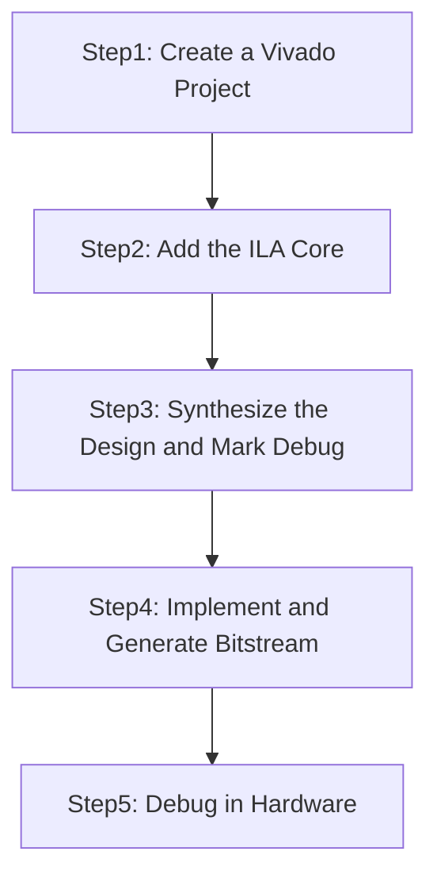
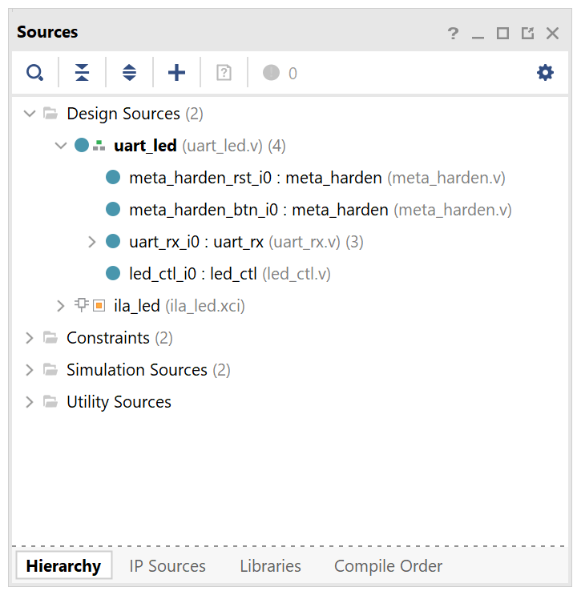
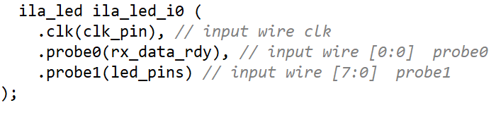
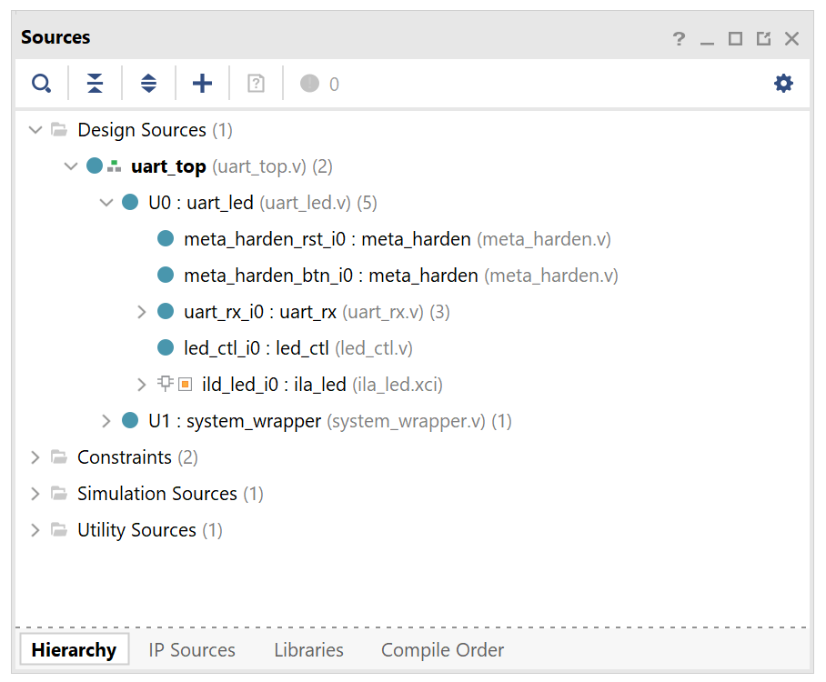
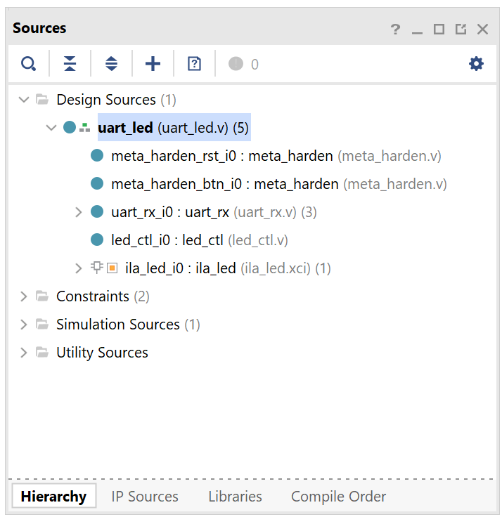

# Hardware Debugging

## Introduction

In this lab you will use the uart_led design that was introduced in the previous labs. You will use Mark Debug feature and also the available Integrated Logic Analyzer (ILA) core (in IP Catalog) to debug the hardware.

## Objectives

After completing this lab, you will be able to:

- Use the Integrated Logic Analyzer (ILA) core from the IP Catalog as a debugging tool.

- Use Mark Debug feature of Vivado to debug a design.

- Use hardware debugger to debug a design.


## Design Description

The design consists of a uart receiver receiving the input typed on a keyboard and displaying the binary equivalent of the typed character on the LEDs.  When a push button is pressed, the lower and upper nibbles are swapped.

---

**For PYNQ-Z2**

In this design we will use board’s USB-UART which is connected to, and controlled by the Zynq’s ARM Cortex-A9 processor. Our PL design needs access to this USB-UART. We will use a *Processing System* (PS) design which will make the USB-UART connection available to the PL.

The provided design places the UART (RX) pin of the PS on the Cortex-A9 in a simple GPIO mode to allow the UART to be connected (passed through) to the programmable logic.  The PS samples the RX signal and sends it to the EMIO channel 0 which is connected to RX input of the HDL design. This is done through a software application provided in the lab6.sdk directory.

**For Boolean:**

The Boolean board is more straightforward. It has a UART port connected directly to the FPGA which will be used in this design. 

---

<p align="center">

</p>
<p align = "center">
<i>The Complete Design on PYNQ-Z2's PL Side or Whole Design on Boolean</i>
</p>

<p align="center">

</p>
<p align = "center">
<i>The Complete System on PYNQ-Z2</i>
</p>

## General Flow



### Instructions for the Tutorial

The absolute path for the source code should only contain ascii characters. Deep path should also be avoided since the maximum supporting length of path for Windows is 260 characters.

**{BOARD}** refers to target *Boolean* and *Z2* boards.

**{SOURCES}** refers to *./source/{BOARD}/labn*. You can use the source files from the cloned repository's *source* directory

**{TUTORIAL}** refers to *C:\vivado_tutorial/*. It assumes that you will create the mentioned directory structure to carry out the labs of this tutorial

## Steps

### Step 1 Create a Vivado Project using IDE

---

**For PYNQ-Z2:**

#### Launch Vivado and create a project targeting the XC7Z020clg400-1 device, and use the provided tcl script file (ps_init.tcl) to generate the block design for the PS subsystem. Also, add the Verilog HDL files, uart_led_pins_pynq.xdc and uart_led_timing_pynq.xdc files from the *{SOURCES}\lab5* directory.

**For Boolean:**

#### Launch Vivado and create a project targeting XC7S50CSGA324-1 parts, and using the Verilog HDL. Use the provided Verilog source files and XDC  files from the **{SOURCES}**\lab6\ directory.

---

1. Open Vivado by selecting **Start > Xilinx Design Tools > Vivado 2021.2**.

2. Click **Create New Project** to start the wizard. You will see *Create A New Vivado Project* dialog box. Click **Next**.

3. Click the *Browse* button of the *Project location* field of the **New Project** form, browse to **{TUTORIAL}**, and click **Select**.

4. Enter **lab6** in the *Project name* field.  Make sure that the *Create Project Subdirectory* box is checked.  Click **Next**.

5. Select **RTL Project** option in the *Project Type* form, and click **Next**.

6. Using the drop-down buttons, select **Verilog** as the *Target Language* and *Simulator Language* in the *Add Sources* form.

7. Click on the **Blue Plus** button, then the **Add Files…** button and browse to the **{SOURCES}/{BOARD}/lab6** directory, select all the Verilog files *(led\_ctl.v, meta\_harden.v, uart\_baud\_gen.v, uart\_led.v, uart\_rx.v and uart\_rx\_ctl.v ),* click **OK**, and then click **Next**.

8. Click **Next** to get to the *Add Constraints* form.

9. Click on the **Blue Plus** button, then **Add Files…** and browse to the **{SOURCES}/{BOARDS}\lab6** directory (if necessary), select *uart\_led\_timing\_{BOARDS}.xdc* and the appropriate *uart\_led\_pins\_{BOARDS}.xdc* and click **Open**.

10. Click **Next.**

11. In the *Default Part* form, use the **Parts** option and various drop-down fields of the **Filter** section, select the **XC7Z020clg400-1**(PYNQ-Z2) or **XC7S50CSGA324-1**(Boolean) part.

12. Click **Next**.

13. Click **Finish** to create the Vivado project.  

    ---

    **If you are using PYNQ-Z2**

14. Copy the `ps_init.tcl` to the path **{TUTORIAL}/lab6**. In the Tcl Shell window enter the following command to change to the lab directory and hit the Enter key.

    ```tcl
    cd {TUTORIAL}/lab6
    ```

15. Generate the PS design by executing the provided Tcl script.

    ```tcl
    source ps_init.tcl
    ```

    This script will create a block design called *system*, instantiate ZYNQ PS with one GPIO channel (GPIO14) and one EMIO channel. It will then create a top-level wrapper file called system\_wrapper.v which will instantiate the system.bd (the block design). You can check the contents of the tcl files to confirm the commands that are being run.

    ---

16. Double-click on the **uart\_led** entry to view its content.

    Notice in the Verilog code, the BAUD\_RATE and CLOCK\_RATE parameters are defined to be 115200 and 125 MHz(PYNQ-Z2) and 100 MHz(Boolean) respectively.

    <p align="center">
    
    </p>
    <p align = "center">
    <i>CLOCK_RATE parameter of uart_led(PYNQ-Z2 as Example)</i>
    </p>

### Step 2 Add the ILA Core

1. Click **Flow Navigator > PROJECT MANAGER > IP Catalog**.

   The catalog will be displayed in the Auxiliary pane.

2. Expand the **Debug & Verification > Debug** folders and double-click the **ILA(Integrated Logic Analyzer)** entry.

   <p align="center">
   
   </p>
   <p align = "center">
   <i>ILA in IP Catalog</i>
   </p>


   You will be connecting the ILA core/component to the LED port which is 8-bit wide.

3. Double click the **ILA(Integrated Logic Analyzer > Customize IP** on the following Add IP window. The ILA IP will open.

4. Change the component name to **ila\_led**.

5. Change the *Number of Probes* to **2**.

   <p align="center">
   
   </p>
   <p align = "center">
   <i>Setting the component name and the number of probes field</i>
   </p>

6. Select the *Probe Ports* tab and change the PROBE1 port width to **8**, leaving the PROBE0 width to **1**.

   <p align="center">
   
   </p>
   <p align = "center">
   <i>Setting the probes widths</i>
   </p>

7. Click **OK**.

   The *Generate Output* Products dialog box will appear.

   <p align="center">
   
   </p>
   <p align = "center">
   <i>The Generate Output Products</i>
   </p>

8. Click the **Generate** button to generate the core including the instantiation template. Click **OK** at the warning box. Notice the core is added to the *Design Sources* view.

   <p align="center">
   
   </p>
   <p align = "center">
   <i>Newly generated ILA core added in the design source(PYNQ-Z2)</i>
   </p>

   <p align="center">
   
   </p>
   <p align = "center">
   <i>Newly generated ILA core added in the design source(Boolean)</i>
   </p>

9. Select the **IP Sources** tab, expand the **IP(1) > ila\_led > Instantiation Template**, and double-click the **ila\_led.veo** entry to see the instantiation template.

10. Instantiate the *ila\_led* in design by copying lines 56 – 62 and pasting to ~line 69(PYNQ-Z2) or 107(Boolean) (before “endmodule” on the last line) in the top module.

11. Change *your\_instance\_name* to **ila\_led\_i0.**

12. Change the following port names in the Verilog code to connect the ila to existing signals in the design:

    ```verilog
    .clk(CLK)          . clk(clk_pin)

    .probe0(PROBE0)   . probe0(rx_data_rdy)

    .probe1(PROBE1)   . probe1(led_pins)
    ```


    <p align="center">
    
    </p>
    <p align = "center">
    <i>Instantiating the ILA Core in the uart_top.v</i>
    </p>

13. Select **File > Save File**.

    Notice that the ILA Core instance is in the design hierarchy.

    <p align="center">
    
    </p>
    <p align = "center">
    <i>ILA Core added to the design(PYNQ-Z2)</i>
    </p>

    <p align="center">
    
    </p>
    <p align = "center">
    <i>ILA Core added to the design(Boolean)</i>
    </p>

### Step 3 Synthesize the Design and Mark Debug

#### Synthesize the design. Open the synthesized design.  View the schematic. Add Mark Debug on the rx\_data bus between the uart\_rx\_i0 and led\_ctl\_i0 instances.

1. Click **Flow Navigator > SYNTHESIS > Run Synthesis**. Click **Save** to save Project if prompted.

   The synthesis process will be run on the *uart\_top.v* and all its hierarchical files.  When the process is completed a *Synthesis Completed* dialog box with three options will be displayed.

2. Select the *Open Synthesized Design* option and click **OK**.

3. Click on **Flow Navigator > SYNTHESIS > Synthesized Design > Schematic** to view the synthesized design in a schematic view.

4. Expand component **U0**(PYNQ-Z2) or **uart_rx_i0**(Boolean) and Select the **rx\_data** bus between the *uart\_rx\_i0* and the *led\_ctl\_i0* instances or right-click, and select **Mark Debug**.

   <p align="center">
   
   </p>
   <p align = "center">
   <i>Marking a bus to debug(PYNQ-Z2)</i>
   </p>

   <p align="center">
   
   </p>
   <p align = "center">
   <i>Marking a bus to debug(Boolean)</i>
   </p>

5. Select **File > Constraints > Save**.

6. Click **OK**, and then again **OK** to use **uart\_led\_timing\_{BOARDS}.xdc** as the target.

7. Select the **Netlist** tab and notice that the nets which are marked/assigned for debugging have a debug icon next to them.

   <p align="center">
   
   </p>
   <p align = "center">
   <i>Nets with debug icons</i>
   </p>

8. Select the **Debug** layout or **Layout > Debug**.

   Notice that the **Debug** tab is visible in the Console pane showing Assigned and Unassigned Debug Nets groups.

   <p align="center">
   
   </p>
   <p align = "center">
   <i>Debug tab showing assigned and unassigned nets</i>
   </p>

9. Either click on the  button in the top vertical tool buttons of the Debug pane, or right-click on the *Unassigned Debug Nets* and select the **Set up Debug…** option.

   <p align="center">
   
   </p>
   <p align = "center">
   </p>

10. In the *Set Up Debug* wizard click **Next**.

    Note that rx\_data is listed, with the Clock Domain as clk\_pin\_IBUF\_BUFG.

    <p align="center">
    
    </p>
    <p align = "center">
    <i>The remaining nets after removing already assigned nets in the Set Up Debug wizard</i>
    </p>

11. Click **Next** and again **Next** (leaving everything as defaults) then **Finish**.

12. In the *Synthesized Design Schematic*, click on the net on the output side of the BUFG for the input pin named *clk\_pin*. Hover over the now highlighted net and notice the name is *clk\_pin\_IBUF\_BUFG*. This is the clock net selected for the debug nets earlier.

    <p align="center">
    
    </p>
    <p align = "center">
    <i>Locating clk_pin_IBUF_BUFG in the design(PYNQ-Z2)</i>
    </p>

    <p align="center">
    
    </p>
    <p align = "center">
    <i>Locating clk_pin_IBUF_BUFG in the design(Boolean)</i>
    </p>

13. Right click on **uart\_led\_pins\_{BOARD}.xdc** in the sources pane and select **Set as Target Constraint File**. This will save the changes to the file.

14. Select **File > Constraints > Save** and click **OK** and Click **Yes.**

15. Open *uart\_led\_pins\_{BOARDS}.xdc* and notice the debug nets have been appended to the bottom of the file.

### Step 4 Implement and Generate Bitstream

#### Generate the bitstream.    

1. Click on the **Generate Bitstream** to run the implementation and bit generation processes.

2. Click **Yes** to run the implementation processes.

3. When the bitstream generation process has completed successfully, a box with three options will appear.  Select the **Open Hardware Manager** option and click **OK**.

### Step 5 Debug in Hardware

#### Connect the board and power it ON. Open a hardware manager session, and program the FPGA.  

1. Make sure that the Micro-USB cable is connected to the JTAG PROG connector.

2. Turn ON the power.

3. Select the *Open Hardware Manager* option and click **OK**.

   The Hardware Manager window will open indicating “unconnected” status.

4. Click on the **Open target** link, then **Auto Connect** from the dropdown menu.

   You can also click on the **Open recent target** link if the board was already targeted before.

5. The Hardware Session status changes from Unconnected to the server name and the device is highlighted. Also notice that the Status indicates that it is not programmed.

6. Select the device and verify that the **uart\_top.bit** is selected as the programming file in the General tab. Also notice that there is an entry in the *Debug probes file* field.

#### Start a terminal emulator program such as TeraTerm or HyperTerminal. Select an appropriate COM port (you can find the correct COM number using the Control Panel).  Set the COM port for 115200 baud rate communication. Program the FPGA and verify the functionality.

1. Start a terminal emulator program such as TeraTerm or HyperTerminal.

2. Select an appropriate COM port (you can find the correct COM number using the Control Panel).  

3. Set the COM port for 115200 baud rate communication.

4. Right-click on the FPGA, and select **Program Device…** and click **Program**. For PYNQ-Z2, the localhost will show "programmed", **ignore the status and program the device with generated bitstream**.

   The programming bit file be downloaded and the DONE light will be turned ON indicating the FPGA has been programmed. Debug Probes window will also be opened, if not, then select **Window > Debug Probes.**

   In the Hardware window in Vivado notice that there are two debug cores, hw\_ila\_1 and hw\_ila\_2.

   <p align="center">
   
   </p>
   <p align = "center">
   <i>Debug probes</i>
   </p>


   The hardware session status window also opens showing that the FPGA is programmed having two ILA cores with the idle state.

   <p align="center">
   
   </p>
   <p align = "center">
   <i>Hardware session status</i>
   </p>


   Select the target FPGA *xc7z020\_1* or *xc7s50_0*, and click on the **Run Trigger Immediate** button to see the signals in the waveform window.

   <p align="center">
   
   </p>
   <p align = "center">
   <i>Opening the waveform window</i>
   </p>


   Two waveform windows will be created, one for each ILA; one ILA window is for the instantiated ILA core and another for the MARK DEBUG method.

#### Setup trigger conditions to trigger on a write to led port (rx\_data\_rdy\_out=1) and the trigger position to 512. Arm the trigger.

1. In the **Trigger Setup** window, click *Add Probes* and select the **rx\_data\_rdy\_out**.

   <p align="center">
   
   </p>
   <p align = "center">
   <i>Adding a signal to trigger setup</i>
   </p>

2. Set the compare value *(== [B] X)* and change the value from **x** to **1**. Click **OK**.

   <p align="center">
   
   </p>
   <p align = "center">
   <i>Setting the trigger condition</i>
   </p>

3. Set the trigger position of the *hw\_ila\_1* to **512**.

   <p align="center">
   
   </p>
   <p align = "center">
   <i>Setting up the trigger position</i>
   </p>

4. Similarly, set the trigger position of the *hw\_ila\_2* to **512**.

5. Select the *hw\_ila\_1* in the Hardware window and then click on the **Run Trigger** (   ) button. Observe that the *hw\_ila\_1* core is armed and showing the status as **Waiting for Trigger**.  

   <p align="center">
   
   </p>
   <p align = "center">
   <i>Hardware analyzer running in capture mode</i>
   </p>

6. In the terminal emulator window, type a character, and observe that the *hw\_ila\_1* status changes from capturing to idle as the *rx\_data\_rdy\_out* became *1*.

7. Select the *hw\_ila\_data\_1.wcfg* window and see the waveform.  Notice that the *rx\_data\_rdy\_out* goes from 0 to 1 at 512th sample.

   <p align="center">
   
   </p>
   <p align = "center">
   <i>Zoomed waveform view</i>
   </p>


8. Add the *hw\_ila\_2* probes to the trigger window of the *hw\_ila\_2* and change the trigger condtion for *rx\_data[7:0]*’s Radix from Hexadecimal to Binary. Change *XXXX\_XXXX* to **0101\_0101** (for the ASCII equivalent of U).

   <p align="center">
   
   </p>
   <p align = "center">
   <i>Setting up trigger condition for a particular input pattern</i>
   </p>

9. In the Hardware window, right-click on the **hw\_ila\_2** and select **Run Trigger,** and notice that the status of the *hw\_ila\_2* changes  from *idle* to *Waiting for Trigger.* Also notice that the *hw\_ila\_1* status does not change from idle as it is not armed.

10. Switch to the terminal emulator window and  **U** (capital ,shift+u) to trigger the core.

11. Select the corresponding waveform window and verify that it shows 55 after the trigger.

   <p align="center">
   
   </p>
   <p align = "center">
   <i>Second ila core triggered</i>
   </p>

12. When satisfied, Select **File > Close Hardware Manager**. Click **OK** to close it.

13. Close the terminal emulator program and power OFF the board.

14. Close the **Vivado** program by selecting **File > Exit** and click **OK**.

## Conclusion

You used ILA core from the IP Catalog and Mark Debug feature of Vivado to debug the hardware design.  


------------------------------------------------------
<p align="center">Copyright&copy; 2023, Advanced Micro Devices, Inc.</p>